# Boot Process and ESP32 Features

<details>
<summary>Relevant source files</summary>

The following files were used as context for generating this wiki page:

- [m5stack/Makefile](m5stack/Makefile)
- [m5stack/boards/M5STACK_Atom_Lite/mpconfigboard.h](m5stack/boards/M5STACK_Atom_Lite/mpconfigboard.h)
- [m5stack/boards/M5STACK_Atom_Lite/sdkconfig.board](m5stack/boards/M5STACK_Atom_Lite/sdkconfig.board)
- [m5stack/libs/driver/neopixel/__init__.py](m5stack/libs/driver/neopixel/__init__.py)
- [m5stack/libs/driver/neopixel/ws2812.py](m5stack/libs/driver/neopixel/ws2812.py)
- [m5stack/libs/hardware/rgb.py](m5stack/libs/hardware/rgb.py)
- [m5stack/modesp32.c](m5stack/modesp32.c)
- [m5stack/modules/_boot.py](m5stack/modules/_boot.py)
- [m5stack/modules/startup/__init__.py](m5stack/modules/startup/__init__.py)
- [m5stack/modules/startup/atoms3.py](m5stack/modules/startup/atoms3.py)
- [m5stack/modules/startup/atoms3lite.py](m5stack/modules/startup/atoms3lite.py)
- [m5stack/modules/startup/atoms3u.py](m5stack/modules/startup/atoms3u.py)
- [m5stack/modules/startup/stamps3.py](m5stack/modules/startup/stamps3.py)
- [m5stack/version.txt](m5stack/version.txt)
- [third-party/CMakeListsLvgl.cmake](third-party/CMakeListsLvgl.cmake)
- [third-party/Makefile](third-party/Makefile)
- [third-party/modules/_boot.py](third-party/modules/_boot.py)
- [third-party/modules/startup/box3/apps/app_run.py](third-party/modules/startup/box3/apps/app_run.py)
- [third-party/version.txt](third-party/version.txt)

</details>


This page documents the boot sequence and initialization process that occurs when an M5Stack device powered by UIFlow MicroPython starts up, along with ESP32-specific functionality including wake-up sources, hardware features, and MicroPython runtime capabilities. It covers the steps from device power-on through user code execution and the available ESP32 platform features.

## Overview of the Boot Sequence

The UIFlow MicroPython boot process follows a well-defined sequence to initialize the device and prepare it for running user code. The process can be divided into several key stages:

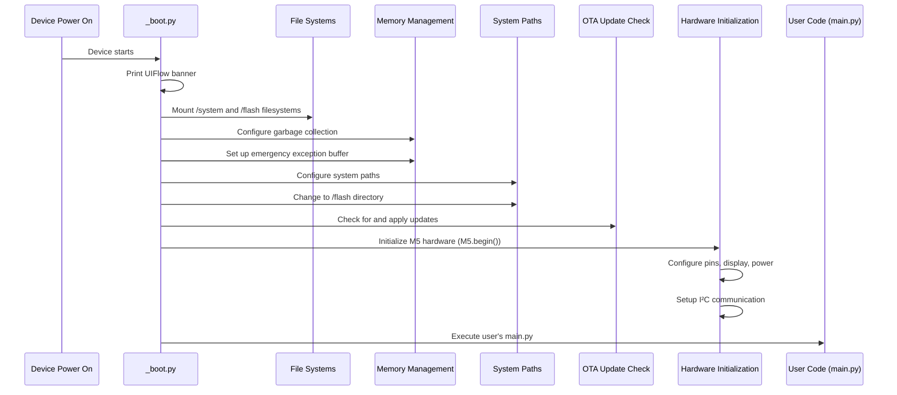

Sources: [m5stack/modules/_boot.py:1-59](https://github.com/m5stack/uiflow-micropython/blob/7af4551a/m5stack/modules/_boot.py#L1-L59), [third-party/modules/_boot.py:1-58](https://github.com/m5stack/uiflow-micropython/blob/7af4551a/third-party/modules/_boot.py#L1-L58)

## Initial System Startup

When an M5Stack device is powered on, the system first executes the `_boot.py` script, which performs several initial setup tasks.

### Banner Display

The boot process begins by displaying the UIFlow banner with the current firmware version obtained from `esp32.firmware_info()[3]`:

```
       _  __ _               
 _   _(_)/ _| | _____      __
| | | | | |_| |/ _ \ \ /\ / /
| |_| | |  _| | (_) \ V  V / 
 \__,_|_|_| |_|\___/ \_/\_/  [firmware version]
```

Sources: [m5stack/modules/_boot.py:11-18](https://github.com/m5stack/uiflow-micropython/blob/7af4551a/m5stack/modules/_boot.py#L11-L18)

### File System Mounting

Next, the boot process mounts two key filesystems:

1. **System Filesystem** (`/system`): Contains core system files and libraries
2. **Flash Filesystem** (`/flash`): Contains user applications and data

If the filesystems don't exist or are corrupted, the system will call `inisetup.setup()` to initialize them.

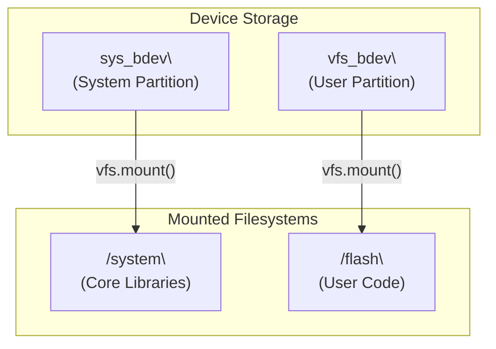

Sources: [m5stack/modules/_boot.py:21-32](https://github.com/m5stack/uiflow-micropython/blob/7af4551a/m5stack/modules/_boot.py#L21-L32)

## Memory Management and System Setup

After mounting the filesystems, the boot process sets up memory management and configures the system environment.

### Memory Configuration

The system configures memory management with the following steps:

1. Run garbage collection to free memory
2. Set garbage collection threshold to 56KB
3. Allocate 256 bytes for emergency exception handling

```python
gc.collect()
gc.threshold(56 * 1024)
micropython.alloc_emergency_exception_buf(256)
```

Sources: [m5stack/modules/_boot.py:34-40](https://github.com/m5stack/uiflow-micropython/blob/7af4551a/m5stack/modules/_boot.py#L34-L40)

### System Paths Configuration

The system sets up the Python module search paths to include:

- `/system`: Core system libraries
- `/flash/libs`: User libraries

Then it changes the current working directory to `/flash` where user applications are stored.

Sources: [m5stack/modules/_boot.py:42-46](https://github.com/m5stack/uiflow-micropython/blob/7af4551a/m5stack/modules/_boot.py#L42-L46)

## OTA Update Handling

The boot process checks for over-the-air (OTA) updates by looking for a file named `main_ota_temp.py` in the flash filesystem. If found, it:

1. Reads the content of `main_ota_temp.py`
2. Writes it to `main.py` (replacing the existing file)
3. Removes the temporary update file

This mechanism allows for remote updates of the main application.

Sources: [m5stack/modules/_boot.py:48-58](https://github.com/m5stack/uiflow-micropython/blob/7af4551a/m5stack/modules/_boot.py#L48-L58)

## Hardware Initialization

After the software environment is set up, the system initializes the hardware components through the `board_init()` function.

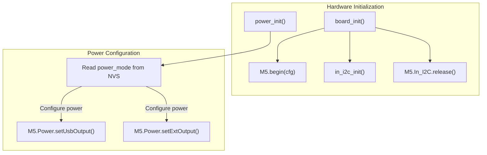

### M5 Hardware Configuration

The hardware initialization process includes:

1. Configuring the M5Stack device with `M5.begin()`
2. Setting up internal I2C communication
3. Initializing power management based on the device type

The power configuration reads settings from non-volatile storage (NVS) or uses defaults if settings aren't found.

Sources: [m5stack/modules/_boot.py:42-46](https://github.com/m5stack/uiflow-micropython/blob/7af4551a/m5stack/modules/_boot.py#L42-L46)

## Execution of User Code

Finally, after all system initialization is complete, the device executes the user's application code in `main.py`. The system can be configured to run this code once or in a continuous loop through the boot option setting in NVS.

## ESP32-Specific Features

The M5Stack firmware provides extensive ESP32-specific functionality through the `esp32` module, implemented in C and exposed to MicroPython.

### Wake-up Sources

The ESP32 supports multiple wake-up sources for low-power operation, configurable through the `esp32` module.

#### Touch Wake-up

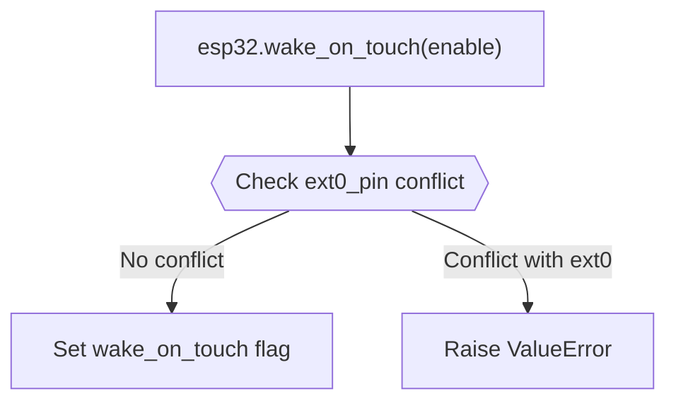

#### External Pin Wake-up (EXT0)

EXT0 allows wake-up from a single GPIO pin with configurable level triggering:

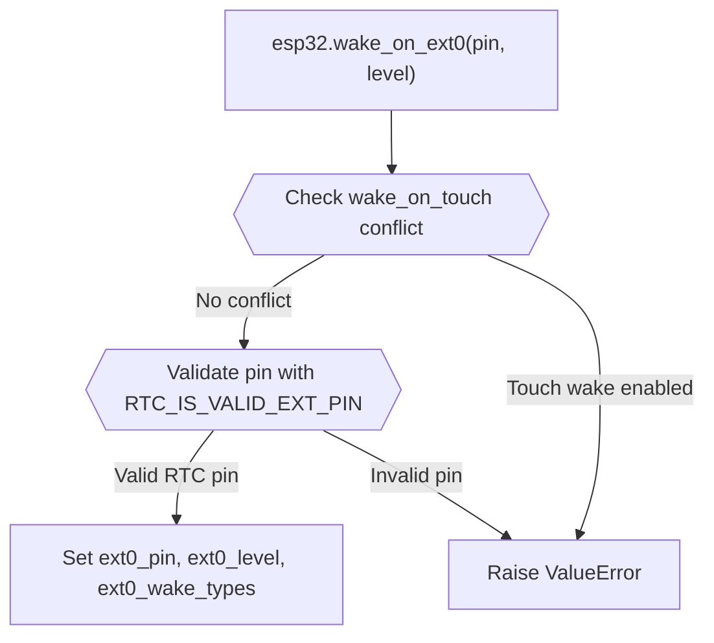

#### External Pin Wake-up (EXT1)

EXT1 supports wake-up from multiple GPIO pins:

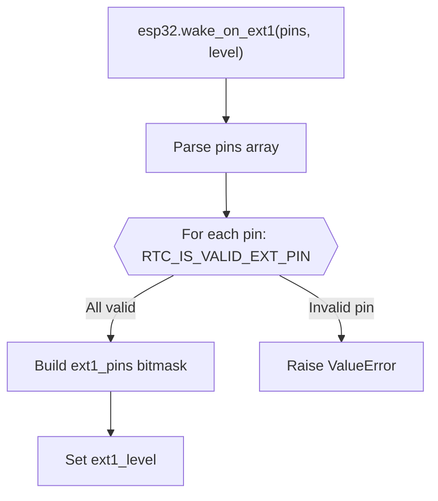

#### ULP Wake-up

The Ultra Low Power (ULP) coprocessor can wake the main CPU:

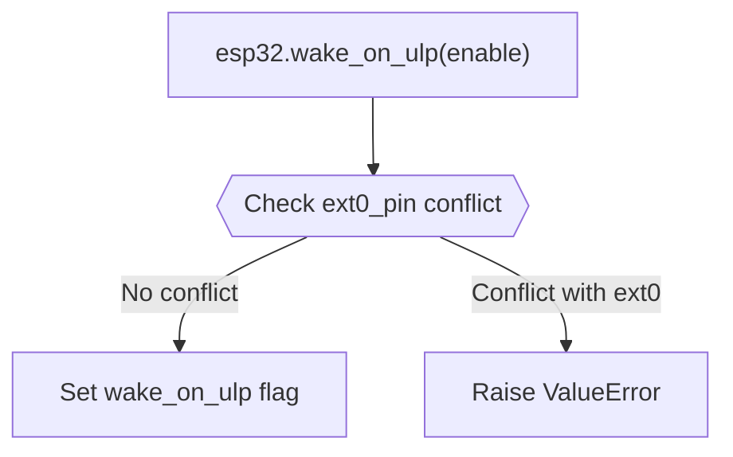

Sources: [m5stack/modesp32.c:52-138](https://github.com/m5stack/uiflow-micropython/blob/7af4551a/m5stack/modesp32.c#L52-L138)

### Temperature Sensing

The ESP32 provides built-in temperature sensing capabilities with different implementations based on the chip variant.

#### ESP32 Classic (Raw Temperature)

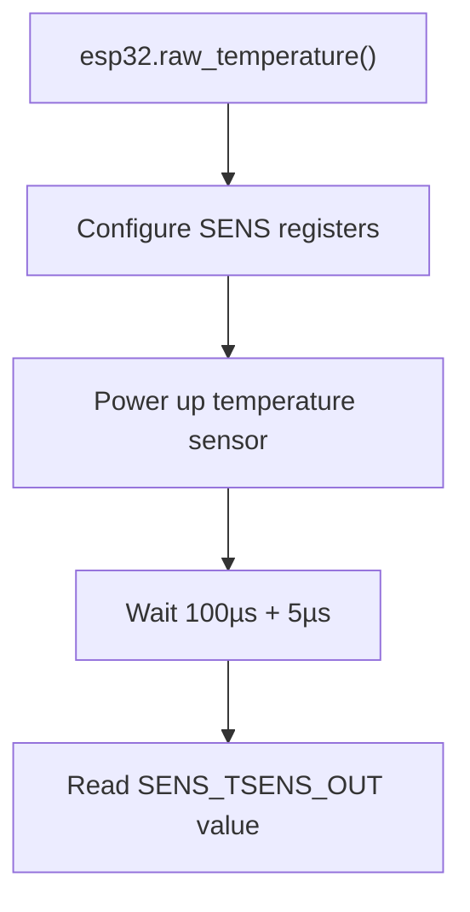

#### ESP32-S2/S3/C3 (Calibrated Temperature)

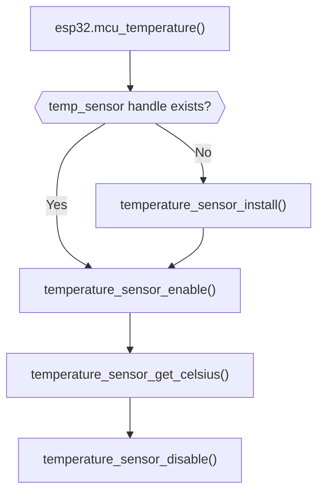

Sources: [m5stack/modesp32.c:152-191](https://github.com/m5stack/uiflow-micropython/blob/7af4551a/m5stack/modesp32.c#L152-L191)

### System Information and Diagnostics

#### Firmware Information

The `esp32.firmware_info()` function provides comprehensive firmware metadata:

| Index | Field | Description |
|-------|-------|-------------|
| 0 | `magic_word` | Application magic word |
| 1 | `secure_version` | Security version |
| 2 | Reserved | Always `None` |
| 3 | `version` | Firmware version string |
| 4 | `project_name` | Project name |
| 5 | `time` | Build time |
| 6 | `date` | Build date |
| 7 | `idf_ver` | ESP-IDF version |
| 8 | `app_elf_sha256` | SHA256 hash (hex string) |
| 9 | Reserved | Always `None` |

#### Heap Information

The `esp32.idf_heap_info(cap)` function provides detailed heap statistics for different memory capabilities:

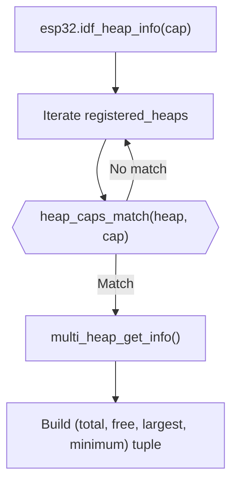

Available heap capability constants:
- `esp32.HEAP_DATA`: Regular data memory (8-bit capable)
- `esp32.HEAP_EXEC`: Executable memory

Sources: [m5stack/modesp32.c:194-243](https://github.com/m5stack/uiflow-micropython/blob/7af4551a/m5stack/modesp32.c#L194-L243)

### Deep Sleep GPIO Hold

For devices that support it, GPIO states can be held during deep sleep:

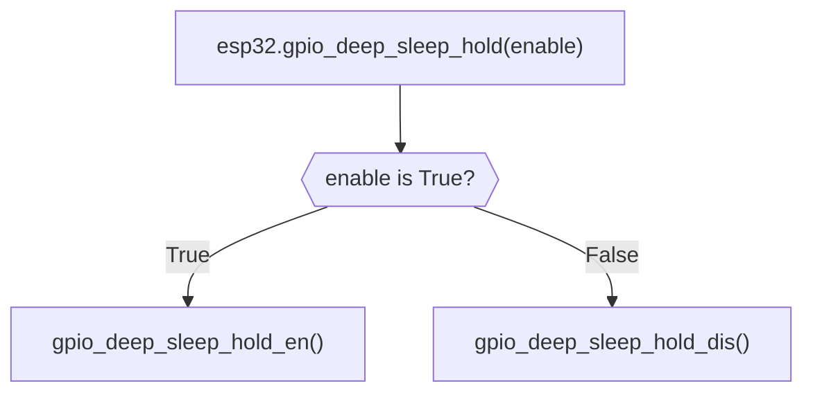

Sources: [m5stack/modesp32.c:140-150](https://github.com/m5stack/uiflow-micropython/blob/7af4551a/m5stack/modesp32.c#L140-L150)

### ESP32 Module Classes

The `esp32` module also provides several hardware interface classes:

| Class | Purpose |
|-------|---------|
| `esp32.NVS` | Non-volatile storage access |
| `esp32.Partition` | Flash partition management |
| `esp32.RMT` | Remote control transceiver |
| `esp32.ULP` | Ultra Low Power coprocessor (ESP32/S2/S3 only) |

Sources: [m5stack/modesp32.c:262-267](https://github.com/m5stack/uiflow-micropython/blob/7af4551a/m5stack/modesp32.c#L262-L267)

### Boot Options and Runtime Configuration

The boot behavior can be controlled through NVS settings in the "uiflow" namespace:

#### Boot Option Configuration

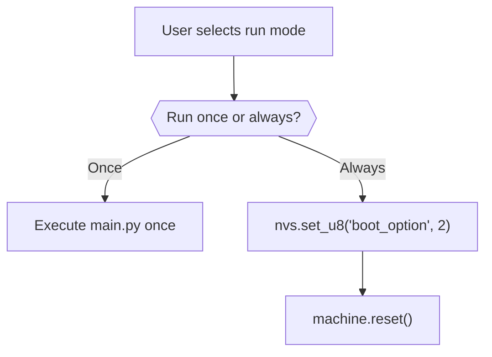

Sources: [third-party/modules/startup/box3/apps/app_run.py:108-117](https://github.com/m5stack/uiflow-micropython/blob/7af4551a/third-party/modules/startup/box3/apps/app_run.py#L108-L117)

## Relationship with Other Core Systems

The boot process is closely related to other core components of the M5Stack system:

- **M5Unified Library**: Provides unified access to M5Stack hardware capabilities; initialized during boot
- **LVGL Integration**: Graphics library initialized as part of the UI system
- **Module Loading System**: Dynamic module loading mechanism set up during system initialization

For more details on these systems, see [M5Unified Library](#4.1) and [LVGL Integration](#4.3).