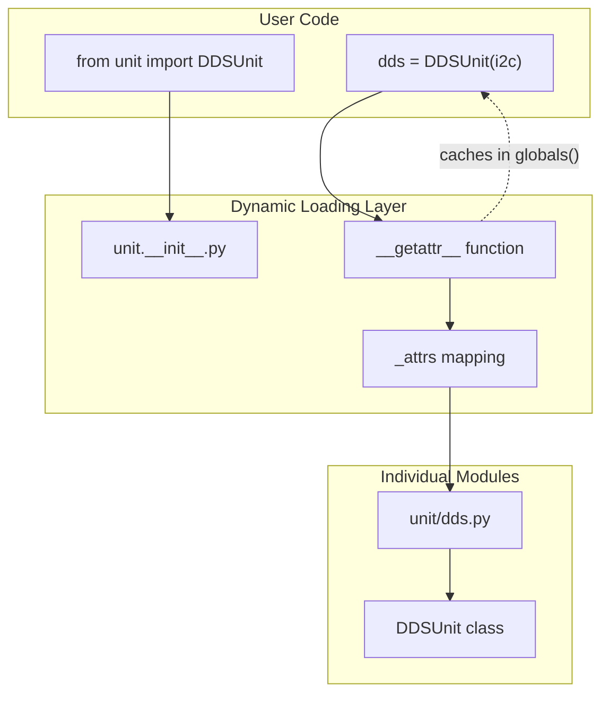
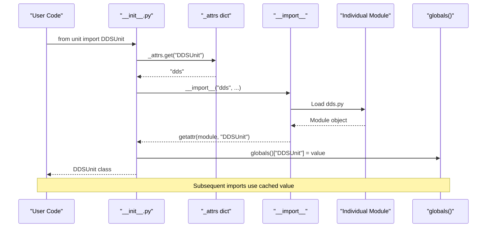
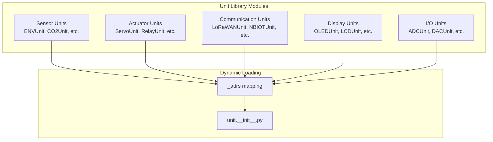
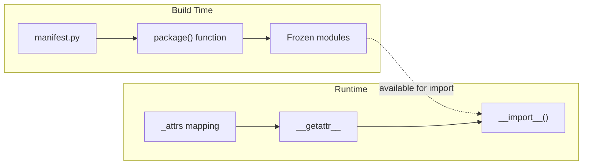

# Dynamic Module Loading

<details>
<summary>Relevant source files</summary>

The following files were used as context for generating this wiki page:

- [docs/en/hardware/can.rst](docs/en/hardware/can.rst)
- [docs/en/hats/index.rst](docs/en/hats/index.rst)
- [docs/en/hats/pir.rst](docs/en/hats/pir.rst)
- [docs/en/hats/servo.rst](docs/en/hats/servo.rst)
- [docs/en/module/index.rst](docs/en/module/index.rst)
- [docs/en/module/pps.rst](docs/en/module/pps.rst)
- [docs/en/refs/hat.pir.ref](docs/en/refs/hat.pir.ref)
- [docs/en/refs/hat.servo.ref](docs/en/refs/hat.servo.ref)
- [docs/en/refs/module.pps.ref](docs/en/refs/module.pps.ref)
- [docs/en/refs/system.bleuart.client.ref](docs/en/refs/system.bleuart.client.ref)
- [docs/en/refs/system.bleuart.ref](docs/en/refs/system.bleuart.ref)
- [docs/en/refs/system.bleuart.server.ref](docs/en/refs/system.bleuart.server.ref)
- [docs/en/refs/unit.dds.ref](docs/en/refs/unit.dds.ref)
- [docs/en/refs/unit.digi_clock.ref](docs/en/refs/unit.digi_clock.ref)
- [docs/en/system/bleuart.client.rst](docs/en/system/bleuart.client.rst)
- [docs/en/system/bleuart.rst](docs/en/system/bleuart.rst)
- [docs/en/units/dds.rst](docs/en/units/dds.rst)
- [docs/en/units/digi_clock.rst](docs/en/units/digi_clock.rst)
- [docs/en/units/index.rst](docs/en/units/index.rst)
- [docs/zh_CN/module/pps.rst](docs/zh_CN/module/pps.rst)
- [docs/zh_CN/refs/module.pps.ref](docs/zh_CN/refs/module.pps.ref)
- [docs/zh_CN/refs/unit.dac2.ref](docs/zh_CN/refs/unit.dac2.ref)
- [docs/zh_CN/unit/dac2.rst](docs/zh_CN/unit/dac2.rst)
- [m5stack/libs/driver/manifest.py](m5stack/libs/driver/manifest.py)
- [m5stack/libs/driver/tca8418.py](m5stack/libs/driver/tca8418.py)
- [m5stack/libs/hardware/__init__.py](m5stack/libs/hardware/__init__.py)
- [m5stack/libs/hardware/ir.py](m5stack/libs/hardware/ir.py)
- [m5stack/libs/hardware/keyboard/__init__.py](m5stack/libs/hardware/keyboard/__init__.py)
- [m5stack/libs/hardware/keyboard/asciimap.py](m5stack/libs/hardware/keyboard/asciimap.py)
- [m5stack/libs/hardware/manifest.py](m5stack/libs/hardware/manifest.py)
- [m5stack/libs/hardware/matrix_keyboard.py](m5stack/libs/hardware/matrix_keyboard.py)
- [m5stack/libs/hardware/plcio.py](m5stack/libs/hardware/plcio.py)
- [m5stack/libs/hardware/sht30.py](m5stack/libs/hardware/sht30.py)
- [m5stack/libs/hat/__init__.py](m5stack/libs/hat/__init__.py)
- [m5stack/libs/hat/hat_helper.py](m5stack/libs/hat/hat_helper.py)
- [m5stack/libs/hat/manifest.py](m5stack/libs/hat/manifest.py)
- [m5stack/libs/hat/pir.py](m5stack/libs/hat/pir.py)
- [m5stack/libs/hat/rs485.py](m5stack/libs/hat/rs485.py)
- [m5stack/libs/hat/servo.py](m5stack/libs/hat/servo.py)
- [m5stack/libs/m5ble/m5ble.py](m5stack/libs/m5ble/m5ble.py)
- [m5stack/libs/module/__init__.py](m5stack/libs/module/__init__.py)
- [m5stack/libs/module/lte.py](m5stack/libs/module/lte.py)
- [m5stack/libs/module/manifest.py](m5stack/libs/module/manifest.py)
- [m5stack/libs/module/module_helper.py](m5stack/libs/module/module_helper.py)
- [m5stack/libs/module/pm25.py](m5stack/libs/module/pm25.py)
- [m5stack/libs/module/pps.py](m5stack/libs/module/pps.py)
- [m5stack/libs/module/relay_4.py](m5stack/libs/module/relay_4.py)
- [m5stack/libs/unit/__init__.py](m5stack/libs/unit/__init__.py)
- [m5stack/libs/unit/cardkb.py](m5stack/libs/unit/cardkb.py)
- [m5stack/libs/unit/dds.py](m5stack/libs/unit/dds.py)
- [m5stack/libs/unit/digi_clock.py](m5stack/libs/unit/digi_clock.py)
- [m5stack/libs/unit/manifest.py](m5stack/libs/unit/manifest.py)
- [m5stack/libs/unit/thermal2.py](m5stack/libs/unit/thermal2.py)
- [m5stack/modules/espnow.py](m5stack/modules/espnow.py)
- [m5stack/modules/manifest.py](m5stack/modules/manifest.py)

</details>


Dynamic module loading is a cross-cutting architectural pattern implemented throughout the M5Stack UIFlow MicroPython library ecosystem to enable lazy loading of hardware driver modules. This system allows users to import any hardware class directly from top-level packages without loading unnecessary modules into memory, optimizing both startup time and memory usage.

For information about the specific hardware libraries that use this pattern, see [Hardware Abstraction Libraries](#2). For details about the build system that packages these modules, see [Build System Architecture](#5.1).

## Overview and Purpose

The dynamic loading system enables imports like `from unit import DDSUnit` or `from module import LTEModule` while deferring the actual loading of the underlying module files until the class is first accessed. This is particularly important for the Unit library, which contains over 100 different hardware drivers, and ensures that only the required drivers are loaded into memory.

**High-Level Dynamic Loading Architecture**


Sources: [m5stack/libs/unit/__init__.py:144-150](https://github.com/m5stack/uiflow-micropython/blob/7af4551a/m5stack/libs/unit/__init__.py#L144-L150), [m5stack/libs/module/__init__.py:61-67](https://github.com/m5stack/uiflow-micropython/blob/7af4551a/m5stack/libs/module/__init__.py#L61-L67), [m5stack/libs/hat/__init__.py:34-40](https://github.com/m5stack/uiflow-micropython/blob/7af4551a/m5stack/libs/hat/__init__.py#L34-L40)

## Core Implementation Pattern

Each library package (`unit`, `module`, `hat`, `base`) implements the same dynamic loading pattern using two key components: an attribute mapping dictionary and a custom `__getattr__` function.

**Dynamic Loading Mechanism Flow**


The implementation consists of three main parts:

### Attribute Mapping Dictionary

Each package maintains a mapping dictionary that associates class names with their corresponding module files:

| Library | Mapping Example | Module Count |
|---------|----------------|--------------|
| Unit | `"DDSUnit": "dds"` | 100+ |
| Module | `"LTEModule": "lte"` | 50+ |
| HAT | `"ServoHat": "servo"` | 30+ |

Sources: [m5stack/libs/unit/__init__.py:5-141](https://github.com/m5stack/uiflow-micropython/blob/7af4551a/m5stack/libs/unit/__init__.py#L5-L141), [m5stack/libs/module/__init__.py:7-53](https://github.com/m5stack/uiflow-micropython/blob/7af4551a/m5stack/libs/module/__init__.py#L7-L53), [m5stack/libs/hat/__init__.py:5-31](https://github.com/m5stack/uiflow-micropython/blob/7af4551a/m5stack/libs/hat/__init__.py#L5-L31)

### Dynamic Import Function

The `__getattr__` function handles attribute access for non-existent attributes by:

1. Looking up the module name in `_attrs`
2. Dynamically importing the module using `__import__`
3. Extracting the requested class with `getattr`
4. Caching the result in `globals()` for future access
5. Returning the class to the caller

Sources: [m5stack/libs/unit/__init__.py:144-150](https://github.com/m5stack/uiflow-micropython/blob/7af4551a/m5stack/libs/unit/__init__.py#L144-L150), [m5stack/libs/module/__init__.py:61-67](https://github.com/m5stack/uiflow-micropython/blob/7af4551a/m5stack/libs/module/__init__.py#L61-L67)

### Caching Mechanism

Once a class is imported, it's stored in the package's global namespace, eliminating the overhead of repeated imports. This ensures that `from unit import DDSUnit` followed by another `from unit import DDSUnit` only triggers the dynamic loading once.

## Library-Specific Implementations

### Unit Library Implementation

The Unit library has the most extensive implementation with over 100 hardware drivers:

```python
_attrs = {
    "DDSUnit": "dds",
    "DigiClockUnit": "digi_clock", 
    "LTEModule": "lte",
    # ... 100+ more mappings
}
```

**Unit Library Module Categories**


Sources: [m5stack/libs/unit/__init__.py:5-141](https://github.com/m5stack/uiflow-micropython/blob/7af4551a/m5stack/libs/unit/__init__.py#L5-L141), [m5stack/libs/unit/manifest.py:4-141](https://github.com/m5stack/uiflow-micropython/blob/7af4551a/m5stack/libs/unit/manifest.py#L4-L141)

### Module Library Implementation

The Module library handles larger communication and specialized modules:

```python
_attrs = {
    "LTEModule": "lte",
    "LoRa868V12Module": "lora868_v12",
    "PM25Module": "pm25",
    # ... additional module mappings
}
```

Sources: [m5stack/libs/module/__init__.py:7-53](https://github.com/m5stack/uiflow-micropython/blob/7af4551a/m5stack/libs/module/__init__.py#L7-L53), [m5stack/libs/module/manifest.py:5-58](https://github.com/m5stack/uiflow-micropython/blob/7af4551a/m5stack/libs/module/manifest.py#L5-L58)

### HAT Library Implementation

The HAT library manages accessories for M5Stack Atom devices:

```python
_attrs = {
    "ServoHat": "servo",
    "PIRHat": "pir", 
    "ADCHat": "adc",
    # ... additional HAT mappings
}
```

Sources: [m5stack/libs/hat/__init__.py:5-31](https://github.com/m5stack/uiflow-micropython/blob/7af4551a/m5stack/libs/hat/__init__.py#L5-L31), [m5stack/libs/hat/manifest.py:5-37](https://github.com/m5stack/uiflow-micropython/blob/7af4551a/m5stack/libs/hat/manifest.py#L5-L37)

## Manifest System Integration

The dynamic loading system works in conjunction with manifest files that define which modules are included in firmware builds. Each library has a corresponding `manifest.py` file that lists all available modules:

**Manifest and Dynamic Loading Relationship**


The manifest system ensures that:
- Only listed modules are included in firmware
- The `_attrs` mapping corresponds to available frozen modules
- Dynamic imports will find the expected module files

Sources: [m5stack/libs/unit/manifest.py:4-141](https://github.com/m5stack/uiflow-micropython/blob/7af4551a/m5stack/libs/unit/manifest.py#L4-L141), [m5stack/libs/module/manifest.py:5-58](https://github.com/m5stack/uiflow-micropython/blob/7af4551a/m5stack/libs/module/manifest.py#L5-L58), [m5stack/libs/hat/manifest.py:5-37](https://github.com/m5stack/uiflow-micropython/blob/7af4551a/m5stack/libs/hat/manifest.py#L5-L37)

## Benefits and Trade-offs

### Memory Efficiency
- **Startup Memory**: Only core package files are loaded initially
- **Runtime Memory**: Individual drivers loaded only when needed
- **Cache Efficiency**: Loaded modules remain cached for subsequent use

### Import Simplicity
- **Unified Interface**: `from unit import DDSUnit` regardless of internal module structure
- **Discoverability**: All classes available from top-level imports
- **IDE Support**: Auto-completion works with cached imports

### Performance Characteristics
- **First Access**: Slight overhead for dynamic import and caching
- **Subsequent Access**: Direct global namespace lookup (fast)
- **Memory Trade-off**: Cached imports remain in memory once loaded

Sources: [m5stack/libs/unit/__init__.py:144-150](https://github.com/m5stack/uiflow-micropython/blob/7af4551a/m5stack/libs/unit/__init__.py#L144-L150), [m5stack/libs/module/__init__.py:55-67](https://github.com/m5stack/uiflow-micropython/blob/7af4551a/m5stack/libs/module/__init__.py#L55-L67), [m5stack/libs/hat/__init__.py:34-40](https://github.com/m5stack/uiflow-micropython/blob/7af4551a/m5stack/libs/hat/__init__.py#L34-L40)

## Error Handling

When a requested class is not found in the `_attrs` mapping, the system raises an `AttributeError` with the requested attribute name, providing clear feedback about unavailable modules:

```python
def __getattr__(attr):
    mod = _attrs.get(attr, None)
    if mod is None:
        raise AttributeError(attr)
    # ... continue with import
```

This ensures that typos or requests for non-existent hardware drivers fail quickly with descriptive error messages.

Sources: [m5stack/libs/unit/__init__.py:145-147](https://github.com/m5stack/uiflow-micropython/blob/7af4551a/m5stack/libs/unit/__init__.py#L145-L147), [m5stack/libs/module/__init__.py:62-64](https://github.com/m5stack/uiflow-micropython/blob/7af4551a/m5stack/libs/module/__init__.py#L62-L64), [m5stack/libs/hat/__init__.py:35-37](https://github.com/m5stack/uiflow-micropython/blob/7af4551a/m5stack/libs/hat/__init__.py#L35-L37)