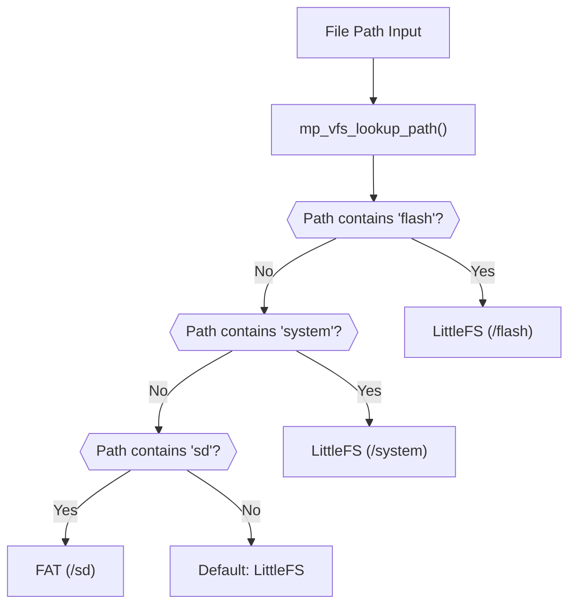
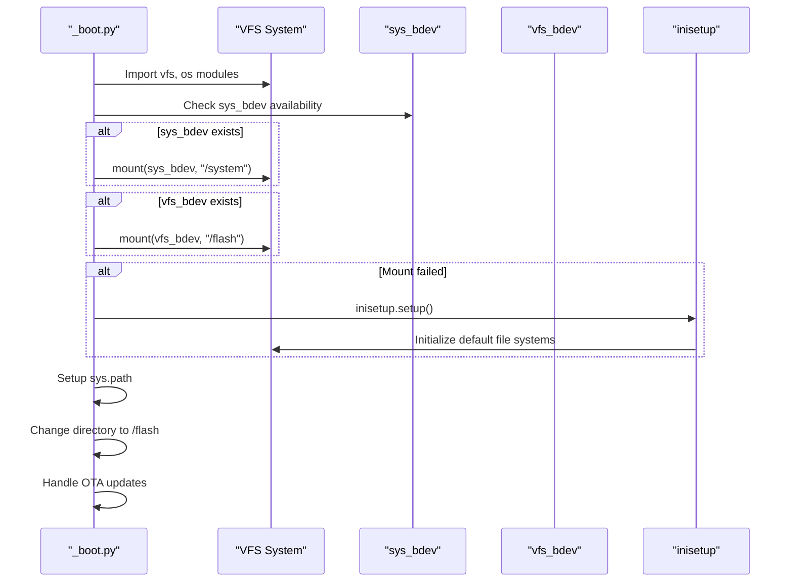
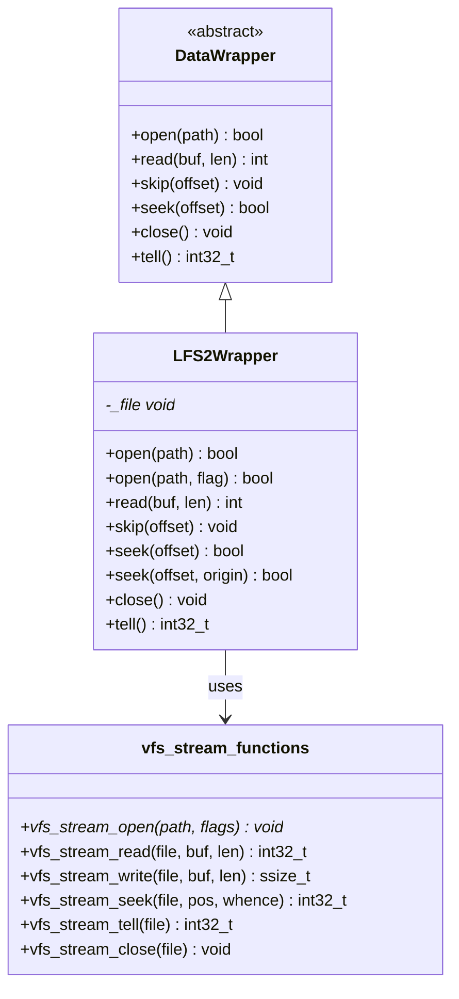
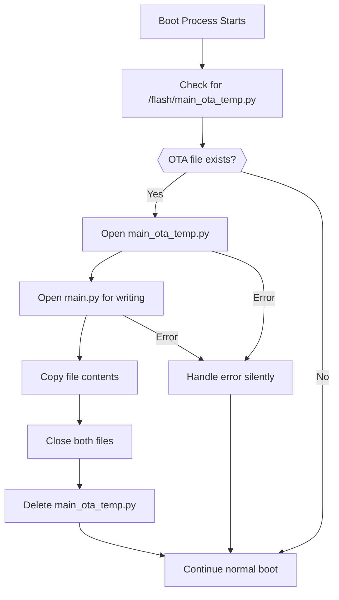

# File System and Storage

<details>
<summary>Relevant source files</summary>

The following files were used as context for generating this wiki page:

- [m5stack/_vfs_stream.c](m5stack/_vfs_stream.c)
- [m5stack/_vfs_stream.h](m5stack/_vfs_stream.h)
- [m5stack/board.h](m5stack/board.h)
- [m5stack/cmodules/adf_module/vfs_stream.h](m5stack/cmodules/adf_module/vfs_stream.h)
- [m5stack/cmodules/lv_utils/modlv_utils.c](m5stack/cmodules/lv_utils/modlv_utils.c)
- [m5stack/cmodules/m5audio2/m5audio2.cmake](m5stack/cmodules/m5audio2/m5audio2.cmake)
- [m5stack/cmodules/m5unified/README.md](m5stack/cmodules/m5unified/README.md)
- [m5stack/cmodules/m5unified/m5unified_gfx.c](m5stack/cmodules/m5unified/m5unified_gfx.c)
- [m5stack/cmodules/m5unified/m5unified_imu.c](m5stack/cmodules/m5unified/m5unified_imu.c)
- [m5stack/cmodules/m5unified/m5unified_power.c](m5stack/cmodules/m5unified/m5unified_power.c)
- [m5stack/cmodules/m5unified/m5unified_touch.c](m5stack/cmodules/m5unified/m5unified_touch.c)
- [m5stack/cmodules/m5unified/m5unified_widgets.c](m5stack/cmodules/m5unified/m5unified_widgets.c)
- [m5stack/components/M5Unified/mpy_gfx_stream.c](m5stack/components/M5Unified/mpy_gfx_stream.c)
- [m5stack/components/M5Unified/mpy_m5gfx.cpp](m5stack/components/M5Unified/mpy_m5gfx.cpp)
- [m5stack/components/M5Unified/mpy_m5gfx.h](m5stack/components/M5Unified/mpy_m5gfx.h)
- [m5stack/components/M5Unified/mpy_m5imu.cpp](m5stack/components/M5Unified/mpy_m5imu.cpp)
- [m5stack/components/M5Unified/mpy_m5imu.h](m5stack/components/M5Unified/mpy_m5imu.h)
- [m5stack/components/M5Unified/mpy_m5lfs2.txt](m5stack/components/M5Unified/mpy_m5lfs2.txt)
- [m5stack/components/M5Unified/mpy_m5power.cpp](m5stack/components/M5Unified/mpy_m5power.cpp)
- [m5stack/components/M5Unified/mpy_m5touch.cpp](m5stack/components/M5Unified/mpy_m5touch.cpp)
- [m5stack/components/M5Unified/mpy_m5widgets.cpp](m5stack/components/M5Unified/mpy_m5widgets.cpp)
- [m5stack/components/M5Unified/mpy_user_lcd.txt](m5stack/components/M5Unified/mpy_user_lcd.txt)
- [m5stack/patches/2003-Support-LTR553.patch](m5stack/patches/2003-Support-LTR553.patch)
- [tests/display/user_lcd.py](tests/display/user_lcd.py)

</details>


## Purpose and Scope

This document describes the file system and storage architecture in the M5Stack UIFlow MicroPython firmware. It covers the Virtual File System (VFS) abstraction layer, LittleFS integration, boot process file system mounting, and storage access patterns used throughout the system. For information about the build system that assembles these file system components, see [Build System Architecture](#5.1). For details about dynamic module loading that relies on this file system infrastructure, see [Dynamic Module Loading](#4.3).

## File System Architecture

The M5Stack UIFlow firmware uses a layered file system architecture that abstracts different storage backends through a unified VFS interface. The system primarily uses LittleFS for internal flash storage and optionally supports FAT file systems for SD card storage.

```mermaid
graph TB
    subgraph "Application Layer"
        PYTHON["Python Applications"]
        GRAPHICS["Graphics Libraries"]
        WIDGETS["Widget System"]
    end
    
    subgraph "VFS Abstraction Layer"
        VFS_STREAM["vfs_stream_*()"]
        LFS2_WRAPPER["LFS2Wrapper"]
        LVGL_VFS["LVGL VFS Callbacks"]
    end
    
    subgraph "File System Implementations"
        LITTLEFS["LittleFS (lfs2)"]
        FATFS["FAT File System"]
    end
    
    subgraph "Storage Hardware"
        FLASH["Internal Flash"]
        SD_CARD["SD Card"]
    end
    
    subgraph "Mount Points"
        SYSTEM["/system"]
        FLASH_MNT["/flash"]
        SD_MNT["/sd"]
    end
    
    PYTHON --> VFS_STREAM
    GRAPHICS --> LFS2_WRAPPER
    WIDGETS --> LVGL_VFS
    
    VFS_STREAM --> LITTLEFS
    VFS_STREAM --> FATFS
    LFS2_WRAPPER --> LITTLEFS
    LVGL_VFS --> LITTLEFS
    LVGL_VFS --> FATFS
    
    LITTLEFS --> FLASH
    FATFS --> SD_CARD
    
    LITTLEFS --> SYSTEM
    LITTLEFS --> FLASH_MNT
    FATFS --> SD_MNT
```



The architecture provides three main abstraction layers:

- **VFS Stream Layer**: Unified file access API used by C/C++ components
- **LFS2Wrapper**: Specialized wrapper for graphics libraries requiring DataWrapper interface
- **LVGL VFS Callbacks**: File system integration for LVGL graphics library

Sources: [m5stack/_vfs_stream.c:1-234](https://github.com/m5stack/uiflow-micropython/blob/7af4551a/m5stack/_vfs_stream.c#L1-L234), [m5stack/components/M5Unified/mpy_m5lfs2.txt:1-69](https://github.com/m5stack/uiflow-micropython/blob/7af4551a/m5stack/components/M5Unified/mpy_m5lfs2.txt#L1-L69), [m5stack/cmodules/lv_utils/modlv_utils.c:1-240](https://github.com/m5stack/uiflow-micropython/blob/7af4551a/m5stack/cmodules/lv_utils/modlv_utils.c#L1-L240)

## Virtual File System (VFS) Layer

The VFS layer provides a unified interface for file operations across different file system types. The core implementation is in the `vfs_stream` module, which automatically detects the appropriate file system based on the mount path.

| Function | Purpose | Supported File Systems |
|----------|---------|----------------------|
| `vfs_stream_open()` | Open file with flags | LittleFS, FAT |
| `vfs_stream_read()` | Read data from file | LittleFS, FAT |
| `vfs_stream_write()` | Write data to file | LittleFS, FAT |
| `vfs_stream_seek()` | Seek to file position | LittleFS, FAT |
| `vfs_stream_tell()` | Get current position | LittleFS, FAT |
| `vfs_stream_close()` | Close file handle | LittleFS, FAT |

The VFS layer uses path-based detection to determine the target file system:



Sources: [m5stack/_vfs_stream.c:67-131](https://github.com/m5stack/uiflow-micropython/blob/7af4551a/m5stack/_vfs_stream.c#L67-L131), [m5stack/_vfs_stream.h:25-35](https://github.com/m5stack/uiflow-micropython/blob/7af4551a/m5stack/_vfs_stream.h#L25-L35)

## Boot Process and File System Mounting

The boot process initializes and mounts file systems during early system startup. The `_boot.py` script handles the mounting sequence and sets up the Python environment.



Key mount points established during boot:

- `/system`: System files and libraries (LittleFS)
- `/flash`: User applications and data (LittleFS) 
- `/sd`: Optional SD card storage (FAT, when available)

The boot process also handles Over-The-Air (OTA) updates by checking for `main_ota_temp.py` and copying it to `main.py` if present.

Sources: [m5stack/modules/_boot.py:21-59](https://github.com/m5stack/uiflow-micropython/blob/7af4551a/m5stack/modules/_boot.py#L21-L59), [third-party/modules/_boot.py:21-58](https://github.com/m5stack/uiflow-micropython/blob/7af4551a/third-party/modules/_boot.py#L21-L58)

## Storage Partitions and Usage Patterns

The system organizes storage into distinct partitions with specific purposes:

| Partition | Mount Point | File System | Purpose |
|-----------|-------------|-------------|---------|
| System | `/system` | LittleFS | Firmware libraries, fonts, system resources |
| Flash | `/flash` | LittleFS | User applications, configuration, user data |
| SD Card | `/sd` | FAT | Optional external storage |

### Python Path Configuration

The boot process configures Python module search paths to include both system and user areas:

```python
sys.path.append("/system")
sys.path.append("/flash/libs")
```

### Working Directory

The system sets `/flash` as the default working directory for user applications, allowing relative file paths to resolve to user storage.

Sources: [m5stack/modules/_boot.py:41-46](https://github.com/m5stack/uiflow-micropython/blob/7af4551a/m5stack/modules/_boot.py#L41-L46)

## File Access Patterns in Graphics Libraries

Graphics components use specialized file access patterns optimized for their specific needs. The `LFS2Wrapper` class provides a `DataWrapper` interface compatible with M5GFX graphics operations.

### LFS2Wrapper Implementation

The `LFS2Wrapper` class bridges the VFS system with graphics libraries that expect a `DataWrapper` interface:



### LVGL File System Integration

LVGL (Light and Versatile Graphics Library) uses callback functions to integrate with the VFS system:

- `lv_utils_fs_open_cb()`: Opens files through VFS
- `lv_utils_fs_read_cb()`: Reads file data
- `lv_utils_fs_write_cb()`: Writes file data  
- `lv_utils_fs_seek_cb()`: Seeks within files
- `lv_utils_fs_tell_cb()`: Gets current file position
- `lv_utils_fs_close_cb()`: Closes file handles

Sources: [m5stack/components/M5Unified/mpy_m5lfs2.txt:12-68](https://github.com/m5stack/uiflow-micropython/blob/7af4551a/m5stack/components/M5Unified/mpy_m5lfs2.txt#L12-L68), [m5stack/cmodules/lv_utils/modlv_utils.c:45-217](https://github.com/m5stack/uiflow-micropython/blob/7af4551a/m5stack/cmodules/lv_utils/modlv_utils.c#L45-L217)

## OTA Update Mechanism

The system supports Over-The-Air updates through a simple file replacement mechanism integrated into the boot process. When an OTA update is received, it is stored as `main_ota_temp.py` in the `/flash` partition.

### OTA Update Flow



The OTA mechanism uses a try-except block to handle errors gracefully, ensuring the system can boot even if the OTA update process encounters issues.

Sources: [m5stack/modules/_boot.py:48-58](https://github.com/m5stack/uiflow-micropython/blob/7af4551a/m5stack/modules/_boot.py#L48-L58), [third-party/modules/_boot.py:47-57](https://github.com/m5stack/uiflow-micropython/blob/7af4551a/third-party/modules/_boot.py#L47-L57)