# Build and Deployment System

<details>
<summary>Relevant source files</summary>

The following files were used as context for generating this wiki page:

- [.github/workflows/build-release.yml](.github/workflows/build-release.yml)
- [.github/workflows/code_formatting.yml](.github/workflows/code_formatting.yml)
- [.github/workflows/nightly-build.yml](.github/workflows/nightly-build.yml)
- [.github/workflows/ports_m5stack.yml](.github/workflows/ports_m5stack.yml)
- [.gitlab-ci.yml](.gitlab-ci.yml)
- [README.md](README.md)
- [m5stack/Makefile](m5stack/Makefile)
- [m5stack/boards/M5STACK_AtomS3R_CAM/board.json](m5stack/boards/M5STACK_AtomS3R_CAM/board.json)
- [m5stack/boards/M5STACK_AtomS3R_CAM/mpconfigboard.cmake](m5stack/boards/M5STACK_AtomS3R_CAM/mpconfigboard.cmake)
- [m5stack/boards/M5STACK_AtomS3R_CAM/mpconfigboard.h](m5stack/boards/M5STACK_AtomS3R_CAM/mpconfigboard.h)
- [m5stack/boards/M5STACK_AtomS3R_CAM/sdkconfig.board](m5stack/boards/M5STACK_AtomS3R_CAM/sdkconfig.board)
- [m5stack/boards/M5STACK_Atom_Lite/mpconfigboard.h](m5stack/boards/M5STACK_Atom_Lite/mpconfigboard.h)
- [m5stack/boards/M5STACK_Atom_Lite/sdkconfig.board](m5stack/boards/M5STACK_Atom_Lite/sdkconfig.board)
- [m5stack/boards/M5STACK_CoreInk/mpconfigboard.cmake](m5stack/boards/M5STACK_CoreInk/mpconfigboard.cmake)
- [m5stack/boards/M5STACK_CoreInk/mpconfigboard.h](m5stack/boards/M5STACK_CoreInk/mpconfigboard.h)
- [m5stack/boards/M5STACK_CoreInk/sdkconfig.board](m5stack/boards/M5STACK_CoreInk/sdkconfig.board)
- [m5stack/libs/driver/neopixel/__init__.py](m5stack/libs/driver/neopixel/__init__.py)
- [m5stack/libs/driver/neopixel/ws2812.py](m5stack/libs/driver/neopixel/ws2812.py)
- [m5stack/libs/hardware/rgb.py](m5stack/libs/hardware/rgb.py)
- [m5stack/modules/startup/__init__.py](m5stack/modules/startup/__init__.py)
- [m5stack/modules/startup/atoms3.py](m5stack/modules/startup/atoms3.py)
- [m5stack/modules/startup/atoms3lite.py](m5stack/modules/startup/atoms3lite.py)
- [m5stack/modules/startup/atoms3u.py](m5stack/modules/startup/atoms3u.py)
- [m5stack/modules/startup/manifest_coreink.py](m5stack/modules/startup/manifest_coreink.py)
- [m5stack/modules/startup/stamps3.py](m5stack/modules/startup/stamps3.py)
- [third-party/Makefile](third-party/Makefile)
- [tools/ci.sh](tools/ci.sh)

</details>


## Purpose and Scope

This document describes the multi-platform build and deployment infrastructure for the UIFlow MicroPython firmware, which supports 40+ ESP32-based board variants. The system orchestrates:

- **Build System Architecture** ([Section 5.1](#5.1)): Makefile-based build orchestration, board configuration mapping, filesystem packaging, and dependency management
- **CI/CD Pipeline** ([Section 5.2](#5.2)): Automated continuous integration using GitHub Actions and GitLab CI with ESP-IDF caching and parallel builds
- **Board Configurations and Firmware Assembly** ([Section 5.3](#5.3)): Hierarchical configuration composition, board-specific customizations, and final firmware packaging

For information about the runtime boot sequence that follows deployment, see [Boot Process and ESP32 Features](#4.2).

---

## Build System Overview

The build system uses GNU Make as the primary orchestration layer, wrapping ESP-IDF's CMake-based `idf.py` tool. It manages 40+ board variants across two build trees: `m5stack/` for M5Stack devices and `third-party/` for partner boards.

### Build Target Hierarchy

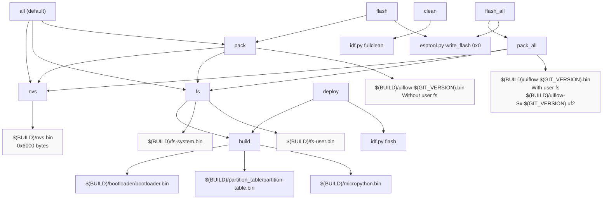

**Target Descriptions:**

| Target | Purpose | Output Files |
|--------|---------|--------------|
| `nvs` | Generate NVS partition for configuration storage | `$(BUILD)/nvs.bin` (24KB fixed) |
| `build` | Compile MicroPython firmware via `idf.py build` | `bootloader.bin`, `partition-table.bin`, `micropython.bin` |
| `fs` | Package filesystem partitions using LittleFS2 | `fs-system.bin`, `fs-user.bin` |
| `pack` | Assemble complete firmware without user filesystem | `uiflow-$(GIT_VERSION).bin` |
| `pack_all` | Assemble firmware with user filesystem | `uiflow-$(GIT_VERSION).bin`, `uiflow-Sx-$(GIT_VERSION).uf2` |
| `flash` | Flash firmware via esptool | - |
| `deploy` | Flash firmware via idf.py (development) | - |
| `clean` | Remove build artifacts | - |

Sources: [m5stack/Makefile:173-261](https://github.com/m5stack/uiflow-micropython/blob/7af4551a/m5stack/Makefile#L173-L261)

---

### Board Configuration System

The build system maps board names to board types and configures build flags accordingly:

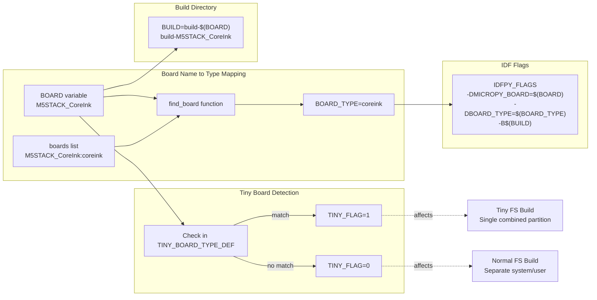

**Board Type Definitions:**

The `boards` variable maps board names to types using the pattern `BOARD_NAME:board-type`:

```
M5STACK_AtomS3:atoms3
M5STACK_CoreInk:coreink
M5STACK_CoreS3:cores3
M5STACK_NanoC6:nanoc6
...
```

The `find_board` function extracts the type from this mapping. Board types determine which directory in `fs/system/` is packaged into `fs-system.bin`.

**Tiny Board Handling:**

Boards with limited flash (4MB or less) have `TINY_FLAG=1`:

```
TINY_BOARD_TYPE_DEF = \
    M5STACK_StickC_PLUS \
    M5STACK_Basic_4MB   \
    M5STACK_CoreInk     \
    M5STACK_StickC      \
    M5STACK_Atom_Lite   \
    M5STACK_Stamp_PICO  \
    M5STACK_Atom_Matrix \
    M5STACK_AtomU       \
    M5STACK_Atom_Echo   \
    M5STACK_NanoC6
```

For tiny boards, the filesystem build combines base files into a single user partition instead of maintaining separate system and user partitions.

Sources: [m5stack/Makefile:11-116](https://github.com/m5stack/uiflow-micropython/blob/7af4551a/m5stack/Makefile#L11-L116), [m5stack/Makefile:223-252](https://github.com/m5stack/uiflow-micropython/blob/7af4551a/m5stack/Makefile#L223-L252)

---

### Patch Management System

The build system applies custom patches to upstream dependencies to fix bugs and add features:

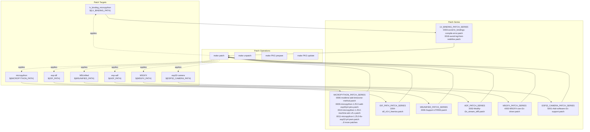

**Key Patch Functions:**

The patch system uses utility functions defined in `m5stack/include/files.mk`:

- `Patch/prepare`: Applies a series of patches to a package
- `Patch/clean`: Unapplies patches from a package  
- `Patch/update`: Updates patch files from modified package

**Example: MicroPython Patches**

The 12 MicroPython patches add critical functionality:

1. `0006-modtime-add-timezone-method.patch`: Adds timezone support to `time` module
2. `0009-micropython-1.25.0-add-esp32p4-pins.patch`: Enables ESP32-P4 support
3. `0010-micropython-1.25.0-machine-adc-v5.x.patch`: Fixes ADC for ESP-IDF v5.x
4. `0011-micropython-1.25.0-fix-esp32-p4-pwm.patch`: PWM fixes for ESP32-P4
5. `0017-micropython-1.25.0-add-uart-mode.patch`: UART mode configuration
6. `0018-micropython-1.25.0-support-esp-idf-v5.4.2.patch`: ESP-IDF v5.4.2 compatibility

Sources: [m5stack/Makefile:298-404](https://github.com/m5stack/uiflow-micropython/blob/7af4551a/m5stack/Makefile#L298-L404)

---

### Filesystem Packaging

The filesystem packaging process creates LittleFS2 partitions from directory trees:

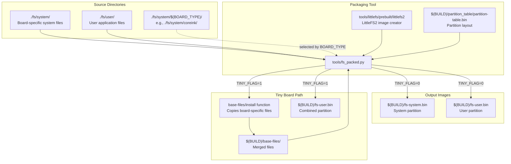

**Normal Filesystem Build (TINY_FLAG=0):**

For boards with sufficient flash, two separate LittleFS2 partitions are created:

```python
# System partition
python tools/fs_packed.py \
    tools/littlefs/prebuilt/littlefs2 \
    $(BOARD_TYPE) \
    ./fs/system \
    $(BUILD)/fs-system.bin \
    $(BUILD)/partition_table/partition-table.bin

# User partition
python tools/fs_packed.py \
    tools/littlefs/prebuilt/littlefs2 \
    $(BOARD_TYPE) \
    ./fs/user \
    $(BUILD)/fs-user.bin \
    $(BUILD)/partition_table/partition-table.bin
```

**Tiny Filesystem Build (TINY_FLAG=1):**

For flash-constrained boards, system files are merged into the user partition:

```make
@if [ ! -d $(BUILD)/base-files ]; then \
    mkdir -p $(BUILD)/base-files; \
fi
$(call base-files/install,$(BOARD_TYPE),$(BUILD)/base-files)
@$(PYTHON) \
    ./../tools/fs_packed.py \
    ./../tools/littlefs/prebuilt/littlefs2 \
    $(BOARD_TYPE) \
    $(BUILD)/base-files \
    $(BUILD)/fs-user.bin \
    $(BUILD)/partition_table/partition-table.bin
```

The `base-files/install` function (defined in `m5stack/include/files.mk`) copies board-specific startup modules and configurations into the merged directory.

Sources: [m5stack/Makefile:222-252](https://github.com/m5stack/uiflow-micropython/blob/7af4551a/m5stack/Makefile#L222-L252)

---

### Firmware Assembly

The final firmware assembly combines all binary components into flashable images:

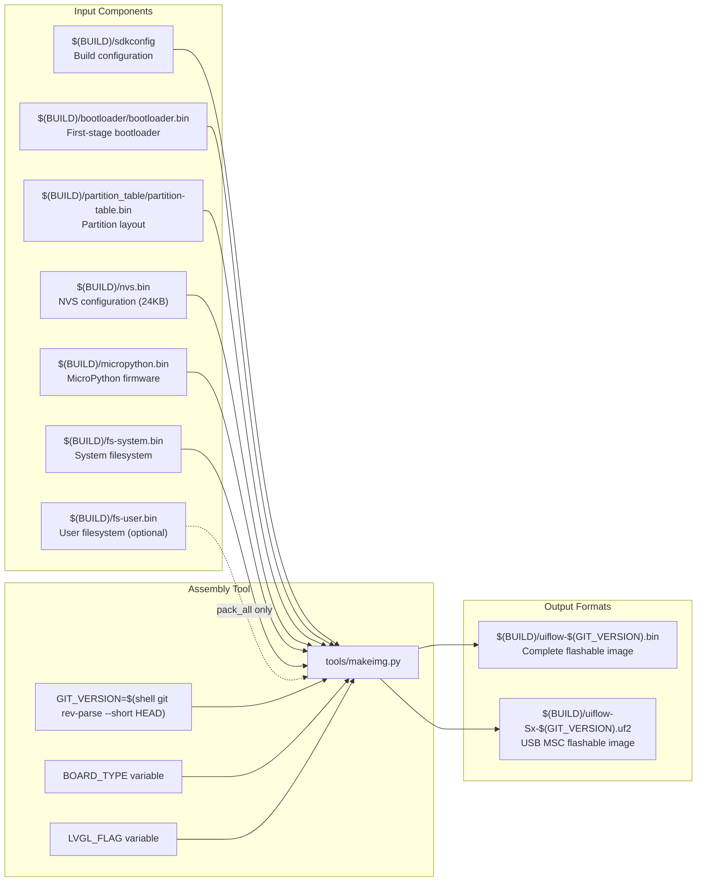

**pack_fw Function:**

The Makefile defines a `pack_fw` function that invokes `makeimg.py`:

```make
define pack_fw
	$(1) makeimg.py \
		$(BUILD)/sdkconfig \
		$(BUILD)/bootloader/bootloader.bin \
		$(BUILD)/partition_table/partition-table.bin \
		$(BUILD)/nvs.bin \
		$(BUILD)/micropython.bin \
		$(BUILD)/fs-system.bin \
		$(2) \
		$(BOARD_TYPE) \
		$(LVGL_FLAG) \
		$(BUILD)/uiflow-$(GIT_VERSION).bin \
		$(BUILD)/uiflow-Sx-$(GIT_VERSION).uf2
endef
```

**Usage:**

```make
# Pack without user filesystem (release builds)
pack: fs
	$(call pack_fw,$(PYTHON),none)

# Pack with user filesystem (development builds)
pack_all: fs
	$(call pack_fw,$(PYTHON),$(BUILD)/fs-user.bin)
```

**Output Files:**

- `uiflow-$(GIT_VERSION).bin`: Complete binary image flashable at address 0x0
- `uiflow-Sx-$(GIT_VERSION).uf2`: UF2 format for boards with USB MSC bootloader support

Sources: [m5stack/Makefile:156-169](https://github.com/m5stack/uiflow-micropython/blob/7af4551a/m5stack/Makefile#L156-L169), [m5stack/Makefile:254-261](https://github.com/m5stack/uiflow-micropython/blob/7af4551a/m5stack/Makefile#L254-L261)

---

## CI/CD Pipeline Architecture

The CI/CD system provides automated builds across multiple platforms using GitHub Actions and GitLab CI, with aggressive caching to optimize build times.

### CI Function Organization

The `tools/ci.sh` script provides modular shell functions for different CI stages:

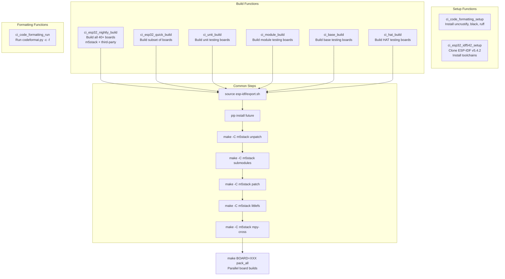

**Build Function Patterns:**

Each build function follows a consistent pattern:

```bash
function ci_esp32_nightly_build {
    source esp-idf/export.sh
    pip install future
    make ${MAKEOPTS} -C m5stack unpatch
    make ${MAKEOPTS} -C m5stack submodules
    make ${MAKEOPTS} -C m5stack patch
    make ${MAKEOPTS} -C m5stack littlefs
    make ${MAKEOPTS} -C m5stack mpy-cross
    make ${MAKEOPTS} -C m5stack BOARD=M5STACK_AirQ pack_all
    make ${MAKEOPTS} -C m5stack BOARD=M5STACK_AtomS3 pack_all
    # ... 40+ boards
    make ${MAKEOPTS} -C third-party BOARD=ESPRESSIF_ESP32_S3_BOX_3 pack_all
}
```

Sources: [tools/ci.sh:185-370](https://github.com/m5stack/uiflow-micropython/blob/7af4551a/tools/ci.sh#L185-L370)

---

### GitHub Actions Workflow

The GitHub Actions workflows use a matrix strategy to parallelize board builds:

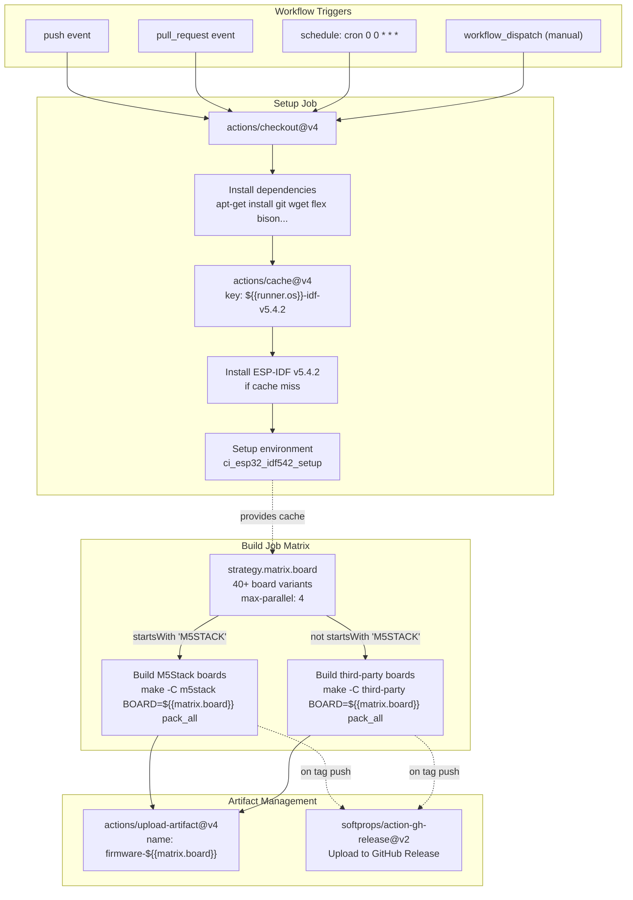

**Matrix Board List:**

The workflow defines 40+ boards in the build matrix:

```yaml
strategy:
  matrix:
    board:
      - M5STACK_AirQ
      - M5STACK_Atom_Echo
      - M5STACK_Atom_Lite
      - M5STACK_AtomS3
      - M5STACK_CoreS3
      - M5STACK_NanoC6
      # ... 34 more boards
      - ESPRESSIF_ESP32_S3_BOX_3
      - SEEED_STUDIO_XIAO_ESP32S3
  max-parallel: 4
```

**ESP-IDF Caching Strategy:**

The cache significantly reduces build times:

```yaml
- name: Cache esp-idf
  uses: actions/cache@v4
  id: cache-esp-idf
  with:
    path: |
      ~/.espressif
      ${{ github.workspace }}/esp-idf
    key: ${{ runner.os }}-idf-v5.4.2
```

This caches:
- `~/.espressif`: Toolchains, Python packages (~2GB)
- `esp-idf`: ESP-IDF source tree (~500MB)

Sources: [.github/workflows/nightly-build.yml:1-149](https://github.com/m5stack/uiflow-micropython/blob/7af4551a/.github/workflows/nightly-build.yml#L1-L149), [.github/workflows/build-release.yml:1-153](https://github.com/m5stack/uiflow-micropython/blob/7af4551a/.github/workflows/build-release.yml#L1-L153)

---

### GitLab CI Pipeline

The GitLab CI provides an alternative pipeline with similar functionality:

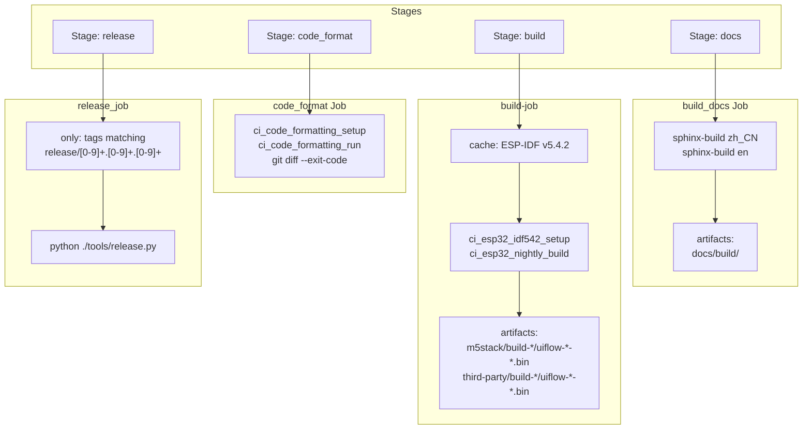

**GitLab Cache Configuration:**

```yaml
cache:
  key: "$CI_PROJECT_ID-esp-idf-v542"
  paths:
    - ${ESP_IDF_SRC_DIR}
  policy: pull-push
  when: on_success
```

**Workflow Control:**

```yaml
workflow:
  auto_cancel:
    on_new_commit: conservative
```

This prevents redundant builds when new commits are pushed during an ongoing build.

**Release Job Trigger:**

```yaml
release_job:
  stage: release
  script:
    - python ./tools/release.py
  only:
    refs:
      - tags
    variables:
      - $CI_COMMIT_TAG =~ /^release\/[0-9]+\.[0-9]+\.[0-9]+$/
```

Sources: [.gitlab-ci.yml:1-85](https://github.com/m5stack/uiflow-micropython/blob/7af4551a/.gitlab-ci.yml#L1-L85)

---

### Code Formatting Enforcement

Both CI systems enforce code formatting using multiple tools:

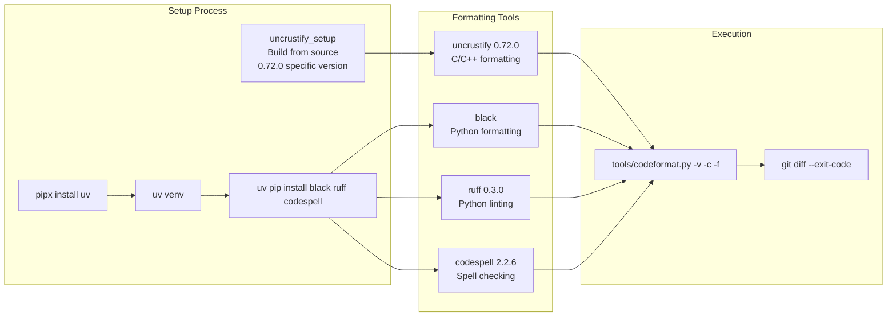

**ci_code_formatting_setup Function:**

```bash
function ci_code_formatting_setup {
    uncrustify_setup
    sudo apt install pipx -y
    pipx install uv
    uv venv
    source .venv/bin/activate
    uv pip install black
    uv pip install micropython-typesheds
    uv pip install ruff==0.3.0
    uv pip install codespell==2.2.6 tomli==2.0.1
    uv pip install pre-commit==3.6.2
    uncrustify --version
    black --version
}
```

**Uncrustify Setup:**

The system requires a specific version (0.72.0) and builds it from source if not present:

```bash
function uncrustify_setup {
    if [ uncrustify --version | grep -q "Uncrustify-0.72.0_f" ]; then
        echo "uncrustify 0.72.0 is already installed."
        return 0
    fi

    wget https://github.com/uncrustify/uncrustify/archive/refs/tags/uncrustify-0.72.0.tar.gz
    tar -xvf uncrustify-0.72.0.tar.gz
    cd uncrustify-uncrustify-0.72.0
    # ... CMake configuration fixes
    mkdir build && cd build
    cmake -DCMAKE_BUILD_TYPE=Release ..
    make -j$(nproc)
    sudo make install
}
```

Sources: [tools/ci.sh:16-58](https://github.com/m5stack/uiflow-micropython/blob/7af4551a/tools/ci.sh#L16-L58)

---

## Board Configuration and Firmware Assembly

### Board Configuration File Hierarchy

Each board defines its configuration through a three-file hierarchy:

```mermaid
graph TB
    subgraph "Board: M5STACK_CoreInk"
        mpconfigboard_cmake["mpconfigboard.cmake<br/>CMake configuration"]
        sdkconfig_board["sdkconfig.board<br/>ESP-IDF menuconfig"]
        mpconfigboard_h["mpconfigboard.h<br/>C preprocessor defines"]
    end
    
    subgraph "mpconfigboard.cmake Contents"
        board_id["BOARD_ID = 6"]
        lvgl_flag["MICROPY_PY_LVGL = 0"]
        sdkconfig_defaults["SDKCONFIG_DEFAULTS<br/>Layered composition"]
        tiny_flag_cmake["TINY_FLAG = 1"]
        frozen_manifest["MICROPY_FROZEN_MANIFEST"]
        lv_cflags["LV_CFLAGS (if LVGL enabled)"]
    end
    
    subgraph "Layered sdkconfig"
        base["sdkconfig.base<br/>Common settings"]
        version_specific["${{SDKCONFIG_IDF_VERSION_SPECIFIC}}<br/>ESP-IDF version"]
        flash["sdkconfig.flash_4mb<br/>Flash size"]
        ble["sdkconfig.ble<br/>Bluetooth"]
        freq["sdkconfig.240mhz<br/>CPU frequency"]
        iram["sdkconfig.disable_iram<br/>IRAM optimization"]
        freertos["sdkconfig.freertos<br/>FreeRTOS config"]
        board_specific["M5STACK_CoreInk/sdkconfig.board<br/>Board-specific"]
    end
    
    subgraph "mpconfigboard.h Contents"
        board_name["MICROPY_HW_BOARD_NAME<br/>M5STACK CoreInk"]
        mcu_name["MICROPY_HW_MCU_NAME<br/>ESP32-S3"]
        lvgl_include["#include mpconfiglvgl.h<br/>(if LVGL enabled)"]
    end
    
    mpconfigboard_cmake --> board_id
    mpconfigboard_cmake --> lvgl_flag
    mpconfigboard_cmake --> sdkconfig_defaults
    mpconfigboard_cmake --> tiny_flag_cmake
    mpconfigboard_cmake --> frozen_manifest
    mpconfigboard_cmake --> lv_cflags
    
    sdkconfig_defaults --> base
    sdkconfig_defaults --> version_specific
    sdkconfig_defaults --> flash
    sdkconfig_defaults --> ble
    sdkconfig_defaults --> freq
    sdkconfig_defaults --> iram
    sdkconfig_defaults --> freertos
    sdkconfig_defaults --> board_specific
    
    mpconfigboard_h --> board_name
    mpconfigboard_h --> mcu_name
    mpconfigboard_h --> lvgl_include
```

**mpconfigboard.cmake Example (M5STACK_CoreInk):**

```cmake
# BOARD_ID from M5Stack board registry
set(BOARD_ID 6)
set(MICROPY_PY_LVGL 0)

set(SDKCONFIG_DEFAULTS
    ./boards/sdkconfig.base
    ${SDKCONFIG_IDF_VERSION_SPECIFIC}
    ./boards/sdkconfig.flash_4mb
    ./boards/sdkconfig.ble
    ./boards/sdkconfig.240mhz
    ./boards/sdkconfig.disable_iram
    ./boards/sdkconfig.freertos
    ./boards/M5STACK_CoreInk/sdkconfig.board
)

set(TINY_FLAG 1)

if(NOT MICROPY_FROZEN_MANIFEST)
    set(MICROPY_FROZEN_MANIFEST ${CMAKE_SOURCE_DIR}/boards/manifest.py)
endif()
```

Sources: [m5stack/boards/M5STACK_CoreInk/mpconfigboard.cmake:1-40](https://github.com/m5stack/uiflow-micropython/blob/7af4551a/m5stack/boards/M5STACK_CoreInk/mpconfigboard.cmake#L1-L40)

---

### Layered sdkconfig Composition

The `SDKCONFIG_DEFAULTS` list creates a layered configuration system:

| Layer | Purpose | Example Settings |
|-------|---------|------------------|
| `sdkconfig.base` | Common ESP32 settings | Compiler flags, optimization level |
| `${SDKCONFIG_IDF_VERSION_SPECIFIC}` | ESP-IDF version compatibility | Version-specific patches |
| `sdkconfig.flash_4mb` / `sdkconfig.flash_8mb` | Flash memory size | Partition sizes, app size limits |
| `sdkconfig.spiram` / `sdkconfig.spiram_oct` | PSRAM configuration | PSRAM size, access mode |
| `sdkconfig.ble` | Bluetooth configuration | BLE stack, NimBLE options |
| `sdkconfig.usb` / `sdkconfig.usb_cdc` | USB support | USB OTG, CDC-ACM console |
| `sdkconfig.240mhz` | CPU frequency | 240MHz operation |
| `sdkconfig.disable_iram` | Memory optimization | Disable IRAM for larger code size |
| `sdkconfig.freertos` | FreeRTOS tuning | Task priorities, stack sizes |
| `sdkconfig.board` | Board-specific overrides | Flash mode, SSL config |

**Example: M5STACK_AtomS3R_CAM Configuration**

This board requires specific flash and camera settings:

```cmake
set(SDKCONFIG_DEFAULTS
    ./boards/sdkconfig.base
    ${SDKCONFIG_IDF_VERSION_SPECIFIC}
    ./boards/sdkconfig.240mhz
    ./boards/sdkconfig.disable_iram
    ./boards/sdkconfig.ble
    ./boards/sdkconfig.usb
    ./boards/sdkconfig.usb_cdc
    ./boards/sdkconfig.flash_8mb
    ./boards/sdkconfig.spiram
    ./boards/sdkconfig.spiram_oct
    ./boards/sdkconfig.freertos
    ./boards/M5STACK_AtomS3R_CAM/sdkconfig.board
)
```

The board-specific `sdkconfig.board` adds camera support:

```
CONFIG_FLASHMODE_DIO=y
CONFIG_ESPTOOLPY_FLASHMODE_DIO=y
CONFIG_ESPTOOLPY_FLASHFREQ_80M=y
CONFIG_SPIRAM_MEMTEST=y

# M5STACK UiFlow USB description
CONFIG_TINYUSB_DESC_CDC_STRING="M5Stack AtomS3R-CAM(UiFlow2)"

# for component/esp32-camera
CONFIG_SCCB_SOFTWARE_SUPPORT=y
```

Sources: [m5stack/boards/M5STACK_AtomS3R_CAM/mpconfigboard.cmake:1-43](https://github.com/m5stack/uiflow-micropython/blob/7af4551a/m5stack/boards/M5STACK_AtomS3R_CAM/mpconfigboard.cmake#L1-L43), [m5stack/boards/M5STACK_AtomS3R_CAM/sdkconfig.board:1-24](https://github.com/m5stack/uiflow-micropython/blob/7af4551a/m5stack/boards/M5STACK_AtomS3R_CAM/sdkconfig.board#L1-L24)

---

### Board-Specific Startup Integration

Boards integrate with the runtime startup system through board type mappings:

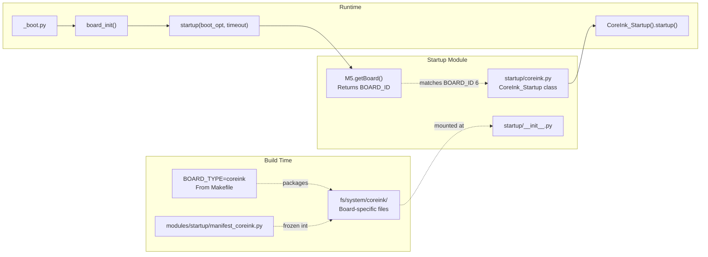

**Startup Manifest Files:**

Each board type has a corresponding manifest file that packages its startup module:

```python
# modules/startup/manifest_coreink.py
package(
    "startup",
    (
        "__init__.py",
        "coreink.py",
    ),
    base_path="..",
    opt=3,
)
```

**Board ID Mapping:**

The `BOARD_ID` set in `mpconfigboard.cmake` matches the runtime `M5.getBoard()` return value:

```python
# startup/__init__.py
board_id = M5.getBoard()
if board_id == M5.BOARD.M5StackCoreInk:
    from .coreink import CoreInk_Startup
    coreink = CoreInk_Startup()
    coreink.startup(ssid, pswd, timeout)
```

Sources: [m5stack/modules/startup/__init__.py:68-194](https://github.com/m5stack/uiflow-micropython/blob/7af4551a/m5stack/modules/startup/__init__.py#L68-L194), [m5stack/modules/startup/manifest_coreink.py:1-14](https://github.com/m5stack/uiflow-micropython/blob/7af4551a/m5stack/modules/startup/manifest_coreink.py#L1-L14)

---

### Final Firmware Assembly Process

The `makeimg.py` tool assembles all components into the final flashable firmware:

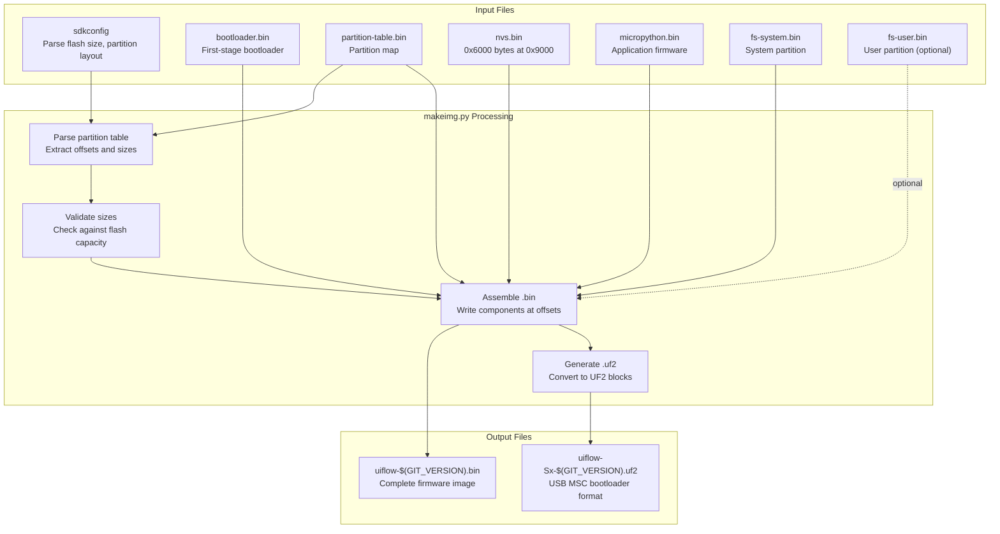

**Partition Layout Example:**

For a typical M5Stack board with 8MB flash:

| Partition | Offset | Size | Source |
|-----------|--------|------|--------|
| bootloader | 0x1000 | ~28KB | `bootloader.bin` |
| partition_table | 0x8000 | 3KB | `partition-table.bin` |
| nvs | 0x9000 | 24KB | `nvs.bin` |
| phy_init | 0xF000 | 4KB | (auto-generated) |
| factory | 0x10000 | ~3MB | `micropython.bin` |
| vfs | varies | ~3MB | `fs-system.bin` |
| user | varies | ~2MB | `fs-user.bin` |

**UF2 Format:**

The UF2 (USB Flashing Format) enables drag-and-drop firmware updates on boards with USB MSC bootloader support. Each UF2 block contains:

- 512-byte block size
- Target flash address
- Payload data (476 bytes)
- Family ID (ESP32-S3: 0xc47e5767)
- CRC32 checksum

Sources: [m5stack/Makefile:156-169](https://github.com/m5stack/uiflow-micropython/blob/7af4551a/m5stack/Makefile#L156-L169)

---

## Build System Variables Reference

### Makefile Variables

| Variable | Default | Purpose | Example |
|----------|---------|---------|---------|
| `BOARD` | `M5STACK_AtomS3` | Target board name | `M5STACK_CoreInk` |
| `BOARD_TYPE` | (auto-detected) | Board type for filesystem selection | `coreink` |
| `TINY_FLAG` | (auto-detected) | Memory-constrained board indicator | `0` or `1` |
| `BUILD` | `build-$(BOARD)` | Build output directory | `build-M5STACK_CoreInk` |
| `PORT` | `/dev/ttyUSB0` | Serial port for flashing | `/dev/ttyACM0` |
| `BAUD` | `1500000` | Flash baud rate | `921600` |
| `CHIP` | `auto` | ESP32 chip type | `esp32`, `esp32s3`, `esp32c3` |
| `LVGL` | (undefined) | Enable LVGL build | `1` |
| `GIT_VERSION` | (auto-detected) | Git commit hash | `a1b2c3d` |
| `PYTHON` | `python3` | Python interpreter | `python3.11` |

### CMake Variables

| Variable | Set By | Purpose |
|----------|--------|---------|
| `MICROPY_BOARD` | Makefile | Board name for CMake | 
| `BOARD_TYPE` | Makefile | Board type for filesystem |
| `BUILD_WITH_LVGL` | Makefile | LVGL enable flag |
| `USER_C_MODULES` | Makefile | Custom C modules path |
| `BOARD_ID` | mpconfigboard.cmake | M5Stack board registry ID |
| `MICROPY_PY_LVGL` | mpconfigboard.cmake | LVGL Python binding |
| `TINY_FLAG` | mpconfigboard.cmake | Tiny board flag |

Sources: [m5stack/Makefile:11-152](https://github.com/m5stack/uiflow-micropython/blob/7af4551a/m5stack/Makefile#L11-L152)

---

## CI/CD Environment Variables

### GitHub Actions

| Variable | Purpose | Example |
|----------|---------|---------|
| `${{ runner.os }}` | Cache key OS component | `Linux` |
| `${{ matrix.board }}` | Current board in matrix | `M5STACK_CoreS3` |
| `${{ github.workspace }}` | Workspace root | `/home/runner/work/uiflow-micropython` |
| `${{ github.ref }}` | Git reference | `refs/tags/2.3.6` |
| `IDF_VERSION` | ESP-IDF version | `v5.4.2` |

### GitLab CI

| Variable | Purpose | Example |
|----------|---------|---------|
| `$CI_PROJECT_DIR` | Project directory | `/builds/m5stack/uiflow-micropython` |
| `$CI_PROJECT_ID` | Project ID for cache key | `12345` |
| `$CI_COMMIT_TAG` | Git tag | `release/2.3.6` |
| `$ESP_IDF_SRC_DIR` | ESP-IDF source path | `/builds/m5stack/uiflow-micropython/esp-idf` |

Sources: [.github/workflows/nightly-build.yml:1-149](https://github.com/m5stack/uiflow-micropython/blob/7af4551a/.github/workflows/nightly-build.yml#L1-L149), [.gitlab-ci.yml:1-85](https://github.com/m5stack/uiflow-micropython/blob/7af4551a/.gitlab-ci.yml#L1-L85)