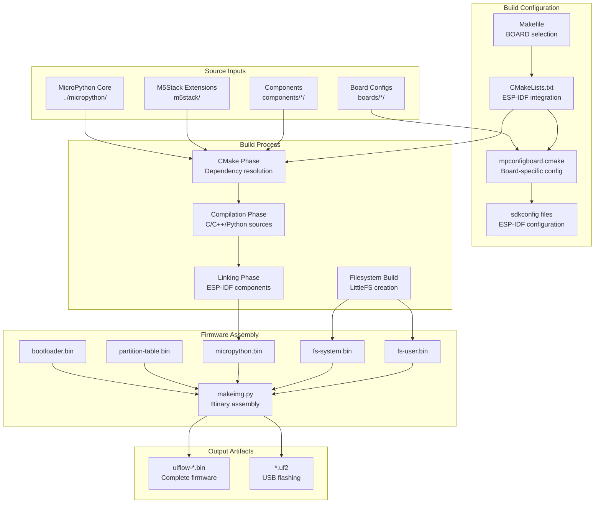
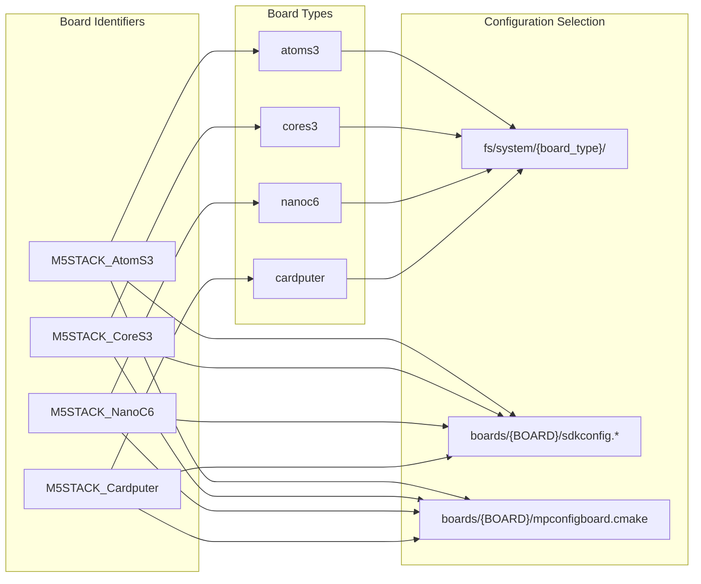
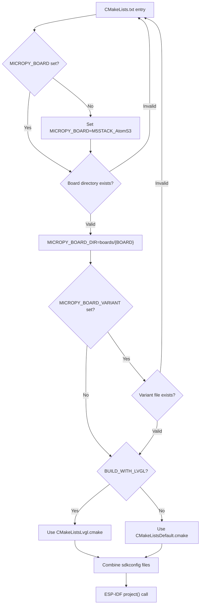
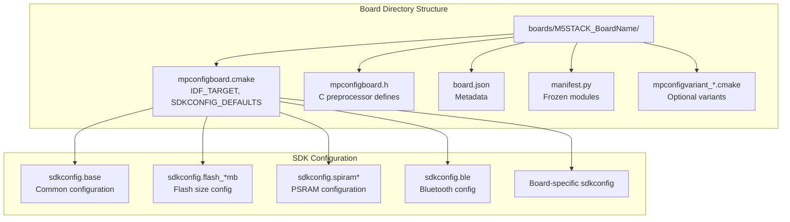
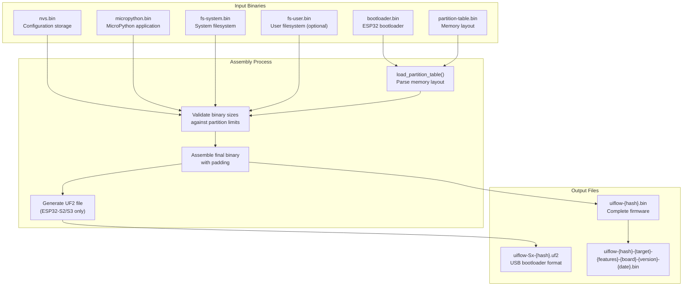
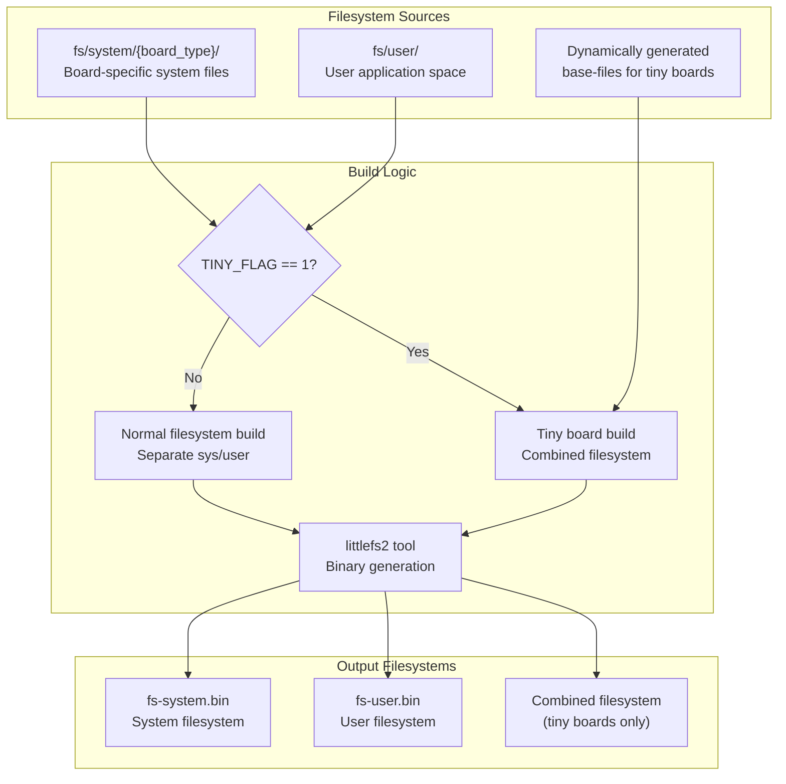
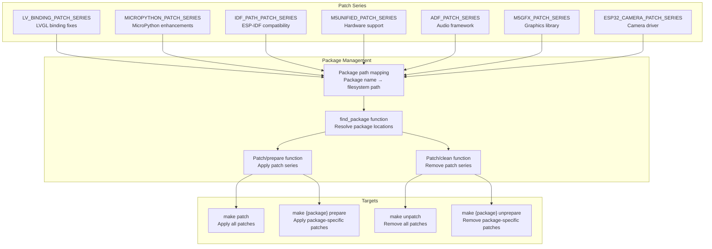

# Build System Architecture

Relevant source files

The following files were used as context for generating this wiki page:

- [m5stack/Makefile](m5stack/Makefile)
- [m5stack/boards/M5STACK_Atom_Lite/mpconfigboard.h](m5stack/boards/M5STACK_Atom_Lite/mpconfigboard.h)
- [m5stack/boards/M5STACK_Atom_Lite/sdkconfig.board](m5stack/boards/M5STACK_Atom_Lite/sdkconfig.board)
- [m5stack/libs/driver/neopixel/__init__.py](m5stack/libs/driver/neopixel/__init__.py)
- [m5stack/libs/driver/neopixel/ws2812.py](m5stack/libs/driver/neopixel/ws2812.py)
- [m5stack/libs/hardware/rgb.py](m5stack/libs/hardware/rgb.py)
- [m5stack/modules/startup/__init__.py](m5stack/modules/startup/__init__.py)
- [m5stack/modules/startup/atoms3.py](m5stack/modules/startup/atoms3.py)
- [m5stack/modules/startup/atoms3lite.py](m5stack/modules/startup/atoms3lite.py)
- [m5stack/modules/startup/atoms3u.py](m5stack/modules/startup/atoms3u.py)
- [m5stack/modules/startup/stamps3.py](m5stack/modules/startup/stamps3.py)
- [third-party/Makefile](third-party/Makefile)

This document describes the build system architecture for the M5Stack UIFlow MicroPython firmware. The build system orchestrates compilation of MicroPython with M5Stack-specific extensions, hardware abstraction layers, and board-specific configurations into deployable firmware binaries.

For information about the resulting firmware components and runtime architecture, see [Core System Architecture](#4). For CI/CD automation and deployment workflows, see [CI/CD Pipeline](#5.2).

## Build System Overview

The M5Stack UIFlow MicroPython build system is a multi-layered architecture that combines GNU Make convenience wrappers with ESP-IDF's CMake-based build system. It supports over 40 board configurations and handles complex dependency management for hardware abstraction libraries, LVGL graphics, and board-specific components.

Sources: [m5stack/Makefile:1-402](https://github.com/m5stack/uiflow-micropython/blob/7af4551a/m5stack/Makefile#L1-L402), [m5stack/CMakeLists.txt:1-99](https://github.com/m5stack/uiflow-micropython/blob/7af4551a/m5stack/CMakeLists.txt#L1-L99), [m5stack/makeimg.py:1-226](https://github.com/m5stack/uiflow-micropython/blob/7af4551a/m5stack/makeimg.py#L1-L226)

## Makefile Layer

The top-level Makefile serves as a convenience wrapper around ESP-IDF's `idf.py` build system, providing simplified commands and board selection logic. It maps board names to board types and constructs appropriate build flags.

### Board Selection and Mapping

The build system supports a comprehensive board mapping that translates board identifiers to internal board types:

The board mapping is defined using a `find_board` function that extracts board types from the boards list. The `TINY_BOARD_TYPE_DEF` list identifies boards with limited resources that require special filesystem handling.

Sources: [m5stack/Makefile:13-96](https://github.com/m5stack/uiflow-micropython/blob/7af4551a/m5stack/Makefile#L13-L96), [m5stack/Makefile:48-50](https://github.com/m5stack/uiflow-micropython/blob/7af4551a/m5stack/Makefile#L48-L50)

### Build Targets and Workflows

The Makefile defines several key targets that orchestrate different aspects of the build process:

| Target | Purpose | Dependencies |
|--------|---------|--------------|
| `all` | Default build with system filesystem | `nvs`, `fs`, `pack` |
| `build` | Compile MicroPython application | `nvs` |
| `pack` | Assemble firmware without user filesystem | `fs` |
| `pack_all` | Assemble firmware with user filesystem | `fs` |
| `flash` | Deploy complete firmware to device | `pack` |
| `clean` | Clean build artifacts | - |
| `submodules` | Initialize Git submodules | - |

The build process uses ESP-IDF flags constructed dynamically based on board selection:

Sources: [m5stack/Makefile:138-143](https://github.com/m5stack/uiflow-micropython/blob/7af4551a/m5stack/Makefile#L138-L143), [m5stack/Makefile:173-260](https://github.com/m5stack/uiflow-micropython/blob/7af4551a/m5stack/Makefile#L173-L260)

## CMake Integration

The CMake layer provides deep integration with ESP-IDF's component system and handles complex dependency resolution for MicroPython extensions, M5Stack components, and board-specific features.

### Component Architecture

```mermaid
graph TD
    subgraph "MicroPython Core"
        MICROPY_PY["MICROPY_SOURCE_PY<br/>py/*.c"]
        MICROPY_EXTMOD["MICROPY_SOURCE_EXTMOD<br/>extmod/*.c"]
        MICROPY_SHARED["MICROPY_SOURCE_SHARED<br/>shared/*.c"]
        MICROPY_LIB["MICROPY_SOURCE_LIB<br/>lib/*.c"]
    end
    
    subgraph "M5Stack Extensions"
        MICROPY_PORT["MICROPY_SOURCE_PORT<br/>ESP32 port + M5 extensions"]
        MICROPY_M5UNIFIED["MICROPY_SOURCE_M5UNIFIED<br/>M5Unified bindings"]
        MICROPY_M5CAMERA["MICROPY_SOURCE_M5CAMERA<br/>Camera module (optional)"]
    end
    
    subgraph "ESP-IDF Components"
        IDF_COMPONENTS["196+ ESP-IDF components<br/>driver, esp_wifi, freertos, etc."]
        M5UNIFIED_COMP["M5Unified Component"]
        ESP32_CAMERA["esp32-camera"]
        UIFLOW_UTILITY["uiflow_utility"]
    end
    
    subgraph "Optional Components"
        ESP_DL["esp-dl (AI/ML)"]
        ESP_CODE_SCANNER["esp-code-scanner"]
        ESP_ADF["ESP-ADF (Audio)"]
        LV_BINDINGS["lv_binding_micropython"]
    end
    
    MICROPY_PY --> IDF_COMPONENTS
    MICROPY_EXTMOD --> IDF_COMPONENTS
    MICROPY_SHARED --> IDF_COMPONENTS
    MICROPY_LIB --> IDF_COMPONENTS
    
    MICROPY_PORT --> M5UNIFIED_COMP
    MICROPY_M5UNIFIED --> M5UNIFIED_COMP
    MICROPY_M5CAMERA --> ESP32_CAMERA
    
    ESP_DL --> ESP32_CAMERA
    ESP_CODE_SCANNER --> ESP32_CAMERA
    LV_BINDINGS --> IDF_COMPONENTS
```

The component registration uses conditional compilation based on board type and feature flags. For example, camera and AI components are only included for specific boards like CoreS3.

Sources: [m5stack/CMakeListsDefault.cmake:167-175](https://github.com/m5stack/uiflow-micropython/blob/7af4551a/m5stack/CMakeListsDefault.cmake#L167-L175), [m5stack/CMakeListsDefault.cmake:196-272](https://github.com/m5stack/uiflow-micropython/blob/7af4551a/m5stack/CMakeListsDefault.cmake#L196-L272), [m5stack/CMakeListsDefault.cmake:245-262](https://github.com/m5stack/uiflow-micropython/blob/7af4551a/m5stack/CMakeListsDefault.cmake#L245-L262)

### Configuration Selection Logic

The CMake system implements sophisticated configuration selection that handles board variants, LVGL support, and feature-specific builds:

Sources: [m5stack/CMakeLists.txt:22-56](https://github.com/m5stack/uiflow-micropython/blob/7af4551a/m5stack/CMakeLists.txt#L22-L56), [m5stack/CMakeLists.txt:66-86](https://github.com/m5stack/uiflow-micropython/blob/7af4551a/m5stack/CMakeLists.txt#L66-L86)

## Board Configuration System

Each board has a dedicated configuration directory containing CMake configuration, header files, and SDK configuration. The system supports board variants for different feature sets or hardware revisions.

### Board Configuration Structure

Board configurations specify the ESP32 target variant, required SDK configuration files, and any board-specific compiler flags. For example, ESP32-C3 boards require different configurations than ESP32-S3 boards.

Sources: [m5stack/boards/M5STACK_C3/mpconfigboard.cmake:1-19](https://github.com/m5stack/uiflow-micropython/blob/7af4551a/m5stack/boards/M5STACK_C3/mpconfigboard.cmake#L1-L19), [m5stack/boards/M5STACK_C3_USB/mpconfigboard.cmake:1-20](https://github.com/m5stack/uiflow-micropython/blob/7af4551a/m5stack/boards/M5STACK_C3_USB/mpconfigboard.cmake#L1-L20), [m5stack/boards/sdkconfig.base:1-144](https://github.com/m5stack/uiflow-micropython/blob/7af4551a/m5stack/boards/sdkconfig.base#L1-L144)

## Firmware Assembly Process

The `makeimg.py` script performs the final firmware assembly by combining multiple binary components into a single flashable image. It reads partition tables to determine memory layout and validates size constraints.

### Binary Assembly Workflow

The assembly process validates that each component fits within its allocated partition space and generates comprehensive filename with target architecture, features, board type, version, and build date.

Sources: [m5stack/makeimg.py:67-177](https://github.com/m5stack/uiflow-micropython/blob/7af4551a/m5stack/makeimg.py#L67-L177), [m5stack/makeimg.py:178-226](https://github.com/m5stack/uiflow-micropython/blob/7af4551a/m5stack/makeimg.py#L178-L226), [m5stack/makeimg.py:154-167](https://github.com/m5stack/uiflow-micropython/blob/7af4551a/m5stack/makeimg.py#L154-L167)

## Filesystem Integration

The build system creates two separate LittleFS filesystems: a system filesystem containing board-specific files and drivers, and an optional user filesystem for application storage.

### Filesystem Build Process

Tiny boards with limited flash use a combined filesystem approach to reduce overhead, while full-featured boards maintain separate system and user filesystems for better organization and update capabilities.

Sources: [m5stack/Makefile:221-250](https://github.com/m5stack/uiflow-micropython/blob/7af4551a/m5stack/Makefile#L221-L250), [m5stack/Makefile:98-114](https://github.com/m5stack/uiflow-micropython/blob/7af4551a/m5stack/Makefile#L98-L114)

## Patch Management System

The build system includes a sophisticated patch management system for applying modifications to upstream dependencies like MicroPython, ESP-IDF, M5Unified, and other components.

### Patch Application Workflow

The patch system allows for selective application of modifications to specific packages and maintains clean separation between upstream code and M5Stack customizations.

Sources: [m5stack/Makefile:302-401](https://github.com/m5stack/uiflow-micropython/blob/7af4551a/m5stack/Makefile#L302-L401), [m5stack/Makefile:335-369](https://github.com/m5stack/uiflow-micropython/blob/7af4551a/m5stack/Makefile#L335-L369), [m5stack/Makefile:384-401](https://github.com/m5stack/uiflow-micropython/blob/7af4551a/m5stack/Makefile#L384-L401)