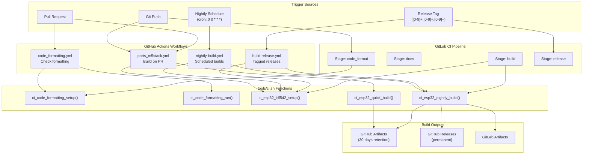
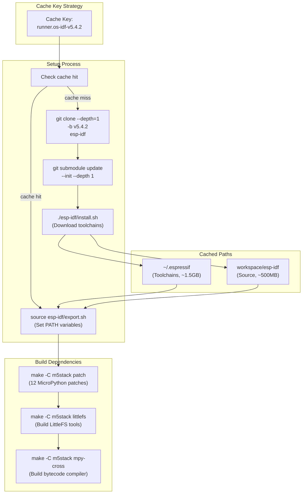
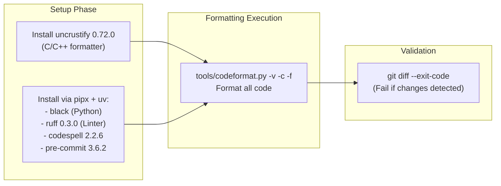
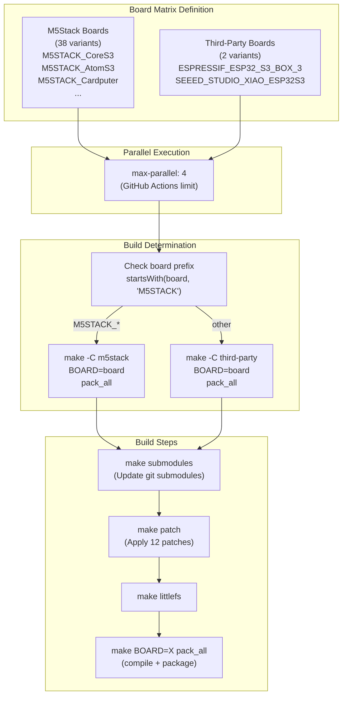
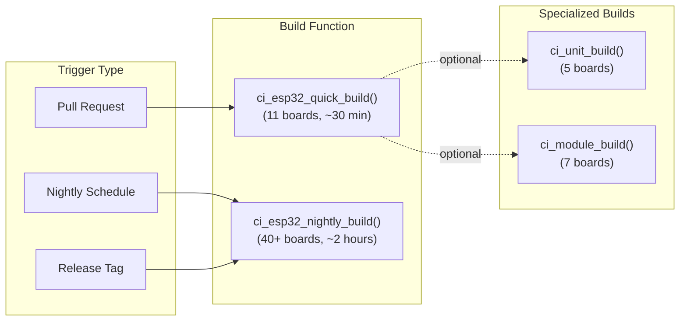
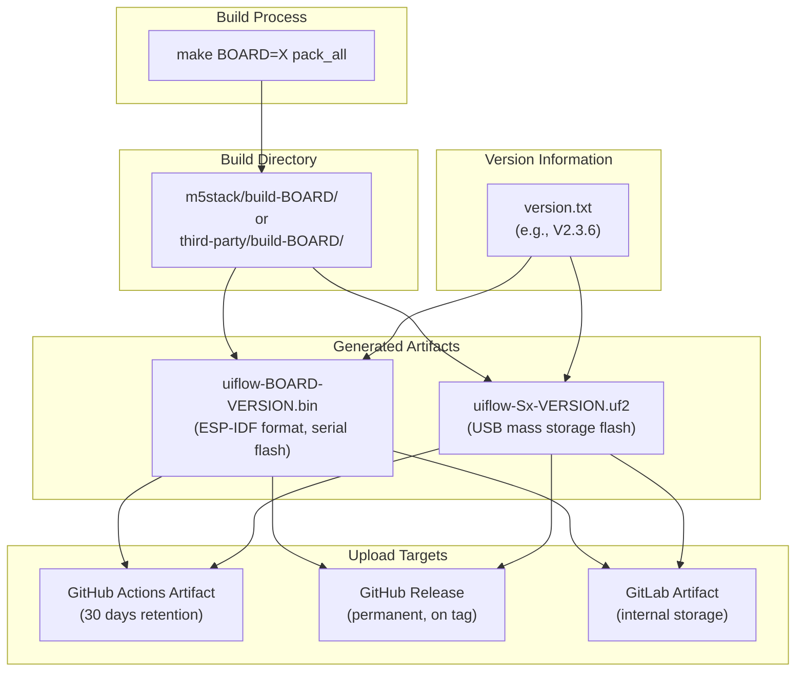
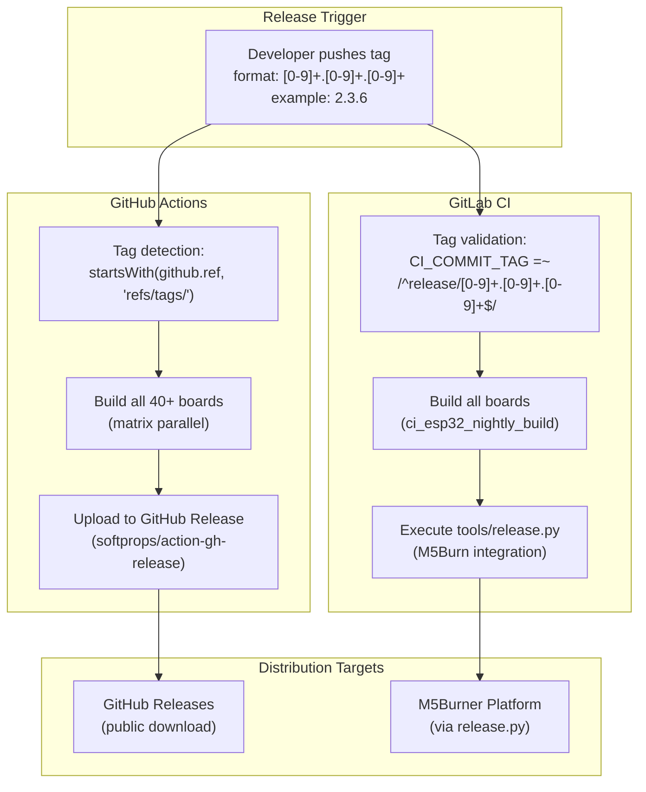
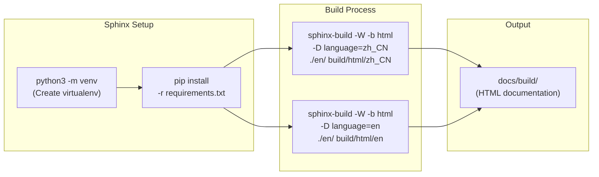
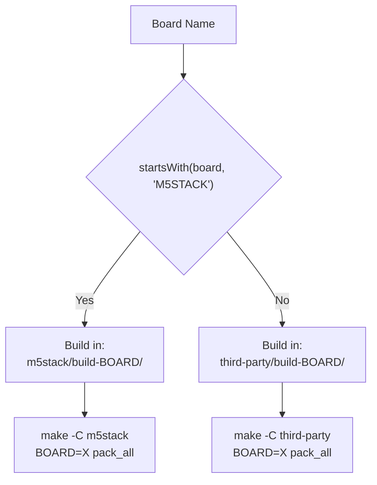

# CI/CD Pipeline

<details>
<summary>Relevant source files</summary>

The following files were used as context for generating this wiki page:

- [.github/workflows/build-release.yml](.github/workflows/build-release.yml)
- [.github/workflows/code_formatting.yml](.github/workflows/code_formatting.yml)
- [.github/workflows/nightly-build.yml](.github/workflows/nightly-build.yml)
- [.github/workflows/ports_m5stack.yml](.github/workflows/ports_m5stack.yml)
- [.gitlab-ci.yml](.gitlab-ci.yml)
- [README.md](README.md)
- [m5stack/boards/M5STACK_AtomS3R_CAM/board.json](m5stack/boards/M5STACK_AtomS3R_CAM/board.json)
- [m5stack/boards/M5STACK_AtomS3R_CAM/mpconfigboard.cmake](m5stack/boards/M5STACK_AtomS3R_CAM/mpconfigboard.cmake)
- [m5stack/boards/M5STACK_AtomS3R_CAM/mpconfigboard.h](m5stack/boards/M5STACK_AtomS3R_CAM/mpconfigboard.h)
- [m5stack/boards/M5STACK_AtomS3R_CAM/sdkconfig.board](m5stack/boards/M5STACK_AtomS3R_CAM/sdkconfig.board)
- [m5stack/boards/M5STACK_CoreInk/mpconfigboard.cmake](m5stack/boards/M5STACK_CoreInk/mpconfigboard.cmake)
- [m5stack/boards/M5STACK_CoreInk/mpconfigboard.h](m5stack/boards/M5STACK_CoreInk/mpconfigboard.h)
- [m5stack/boards/M5STACK_CoreInk/sdkconfig.board](m5stack/boards/M5STACK_CoreInk/sdkconfig.board)
- [m5stack/modules/startup/manifest_coreink.py](m5stack/modules/startup/manifest_coreink.py)
- [tools/ci.sh](tools/ci.sh)

</details>


## Purpose and Scope

This document describes the automated Continuous Integration and Continuous Deployment (CI/CD) infrastructure for the UIFlow MicroPython firmware. The CI/CD pipeline handles code quality enforcement, multi-board compilation (40+ variants), firmware packaging, and artifact distribution through both GitHub Actions and GitLab CI platforms.

For information about the build system itself (Makefiles, board configurations, firmware assembly), see [Build System Architecture](#5.1). For board-specific configuration details, see [Board Configurations and Firmware Assembly](#5.3).

---

## CI/CD Architecture Overview

The CI/CD system operates on two platforms (GitHub Actions and GitLab CI) and executes four primary workflows: code formatting, documentation building, firmware compilation, and release distribution.

**Diagram: CI/CD Workflow Architecture**



**Sources: **
- [.github/workflows/nightly-build.yml:1-149]()
- [.github/workflows/build-release.yml:1-153]()
- [.github/workflows/ports_m5stack.yml:1-154]()
- [.github/workflows/code_formatting.yml:1-24]()
- [.gitlab-ci.yml:1-85]()

---

## CI/CD Triggers

The pipeline responds to multiple trigger types across both platforms:

| Trigger Type | GitHub Actions | GitLab CI | Purpose |
|-------------|----------------|-----------|---------|
| **Push to branch** | `on: push` | Auto-triggered | PR validation builds |
| **Pull request** | `on: pull_request` | N/A | Code review builds |
| **Release tag** | `on: push: tags: [0-9]+.[0-9]+.[0-9]+` | `refs: tags` + regex | Official releases |
| **Nightly schedule** | `on: schedule: cron: 0 0 * * *` | N/A | Regular build health |
| **Manual dispatch** | `workflow_dispatch` | N/A | On-demand builds |

**Sources: **
- [.github/workflows/nightly-build.yml:3-6]()
- [.github/workflows/build-release.yml:3-7]()
- [.gitlab-ci.yml:77-82]()

---

## Build Environment Setup and Caching

The CI pipeline requires ESP-IDF v5.4.2 and associated toolchains (~2GB). Aggressive caching minimizes setup time.

**Diagram: ESP-IDF Setup and Caching Strategy**



The `ci_esp32_idf542_setup()` function handles conditional setup:

```bash
# Check if esp-idf exists and is on correct branch
if [ -d esp-idf ] && [ "$(git -C esp-idf describe --tags)" == "v5.4.2" ]; then
    echo "esp-idf is on v5.4.2 branch."
    return 0
else
    # Clone fresh copy
    git clone --depth 1 --branch v5.4.2 https://github.com/espressif/esp-idf.git
    git -C esp-idf submodule update --init --depth 1
    ./esp-idf/install.sh
fi
```

**Sources: **
- [tools/ci.sh:185-200]()
- [.github/workflows/nightly-build.yml:26-41]()
- [.gitlab-ci.yml:9-14]()

---

## Code Quality Enforcement

Code formatting is enforced before builds proceed. The pipeline fails if formatting issues are detected.

**Diagram: Code Formatting Pipeline**



The `ci_code_formatting_setup()` function installs formatting tools:

**Sources: **
- [tools/ci.sh:39-52]()
- [tools/ci.sh:54-58]()
- [.github/workflows/code_formatting.yml:16-23]()
- [.gitlab-ci.yml:23-34]()

---

## Build Matrix and Parallelization

The pipeline builds 40+ board variants in parallel using a matrix strategy.

**Diagram: Build Matrix Execution**



**Matrix Configuration Examples:**

```yaml
# GitHub Actions matrix (nightly-build.yml)
strategy:
  matrix:
    board:
      - M5STACK_CoreS3
      - M5STACK_AtomS3
      - M5STACK_Cardputer
      # ... 37 more boards
      - ESPRESSIF_ESP32_S3_BOX_3
      - SEEED_STUDIO_XIAO_ESP32S3
  max-parallel: 4
```

The `ci_esp32_nightly_build()` function builds all boards sequentially:

**Sources: **
- [.github/workflows/nightly-build.yml:54-94]()
- [tools/ci.sh:319-370]()
- [.github/workflows/build-release.yml:54-96]()

---

## Specialized Build Functions

The CI script provides multiple build functions for different scenarios:

| Function | Boards Built | Use Case | Lines |
|----------|--------------|----------|-------|
| `ci_esp32_nightly_build()` | All 40+ boards | Nightly + release builds | [319-370]() |
| `ci_esp32_quick_build()` | 11 representative boards | PR validation | [236-256]() |
| `ci_unit_build()` | 5 boards for unit testing | Unit package validation | [258-271]() |
| `ci_module_build()` | 7 boards for module testing | Module package validation | [273-288]() |
| `ci_base_build()` | 4 atom-series boards | Base functionality | [291-303]() |
| `ci_hat_build()` | 3 stick-series boards | HAT package validation | [305-316]() |

**Diagram: Build Function Selection**



**Sources: **
- [tools/ci.sh:236-256]()
- [tools/ci.sh:258-271]()
- [tools/ci.sh:273-288]()
- [tools/ci.sh:319-370]()

---

## Firmware Packaging and Artifacts

Each board build produces multiple artifact files with standardized naming.

**Diagram: Firmware Artifact Generation**



**Artifact Upload Configuration:**

```yaml
# GitHub Actions artifact upload
- name: Upload M5Stack firmware artifact
  uses: actions/upload-artifact@v4
  with:
    name: firmware-${{ matrix.board }}
    path: m5stack/build-${{ matrix.board }}/uiflow-*-*.bin

# GitHub Release upload (only on tags)
- name: Upload firmware to release
  uses: softprops/action-gh-release@v2
  if: startsWith(github.ref, 'refs/tags/')
  with:
    files: |
      m5stack/build-${{ matrix.board }}/uiflow-*-*.bin
```

**Sources: **
- [.github/workflows/nightly-build.yml:136-148]()
- [.github/workflows/build-release.yml:138-152]()
- [.gitlab-ci.yml:45-48]()

---

## Release Workflow

Tagged releases trigger special handling for permanent artifact storage.

**Diagram: Release Pipeline Flow**



**GitLab Release Job Configuration:**

```yaml
release_job:
  stage: release
  script:
    - python ./tools/release.py
  only:
    refs:
      - tags
    variables:
      - $CI_COMMIT_TAG =~ /^release\/[0-9]+\.[0-9]+\.[0-9]+$/
```

**Sources: **
- [.github/workflows/build-release.yml:1-7]()
- [.github/workflows/build-release.yml:145-152]()
- [.gitlab-ci.yml:72-84]()

---

## Documentation Build Pipeline

GitLab CI includes automated documentation building for both English and Chinese versions.

**Diagram: Documentation Build Process**



**Sources: **
- [.gitlab-ci.yml:53-69]()

---

## Environment Variables and Configuration

The CI pipeline uses standardized environment variables:

| Variable | Value | Purpose |
|----------|-------|---------|
| `IDF_VERSION` | `v5.4.2` | ESP-IDF version to clone |
| `ESP_IDF_SRC_DIR` | `$CI_PROJECT_DIR/esp-idf` | IDF installation path |
| `DEBIAN_FRONTEND` | `noninteractive` | Suppress apt prompts |
| `MAKEOPTS` | `-j$(nproc)` | Parallel make jobs |

**Sources: **
- [tools/ci.sh:7-11]()
- [.gitlab-ci.yml:5-7]()
- [.github/workflows/build-release.yml:41-42]()

---

## CMake Version Requirements

Recent builds enforce a minimum CMake version for ESP-IDF v5.4.2 compatibility:

```bash
# Check CMake version >= 3.28.3
REQUIRED_VERSION="3.28.3"
CURRENT_VERSION=$(cmake --version | head -n1 | awk '{print $3}')

if [ "$(printf '%s\
' "$REQUIRED_VERSION" "$CURRENT_VERSION" | sort -V | head -n1)" != "$REQUIRED_VERSION" ]; then
    echo "❌ CMake version $CURRENT_VERSION is too old! Require >= $REQUIRED_VERSION"
    exit 1
fi
```

**Sources: **
- [tools/ci.sh:320-326]()

---

## Board-Specific Build Paths

The build system differentiates between M5Stack and third-party boards:

**Diagram: Build Path Routing**



**Sources: **
- [.github/workflows/nightly-build.yml:116-134]()
- [.github/workflows/build-release.yml:118-136]()

---

## Summary

The CI/CD pipeline provides:

- **Multi-platform execution**: GitHub Actions (public) and GitLab CI (internal)
- **Efficient caching**: ESP-IDF v5.4.2 + toolchains cached with ~2GB footprint
- **Code quality gates**: Enforced formatting with uncrustify, black, ruff
- **Parallel builds**: Matrix strategy with max 4 concurrent jobs, 40+ board variants
- **Flexible build functions**: Specialized builds for PRs, nightly, releases, and package validation
- **Automated distribution**: GitHub Releases (public), GitLab artifacts (internal), M5Burner integration
- **Documentation builds**: Multi-language Sphinx documentation with artifact retention

The pipeline ensures firmware quality and availability across the entire M5Stack product line through automated testing and distribution workflows.