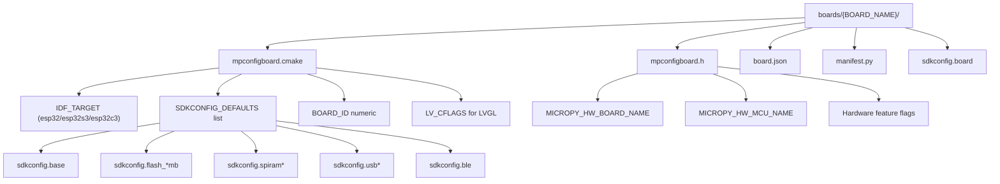
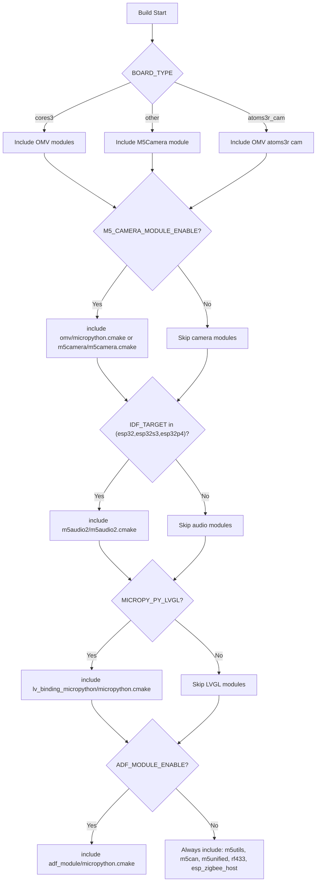
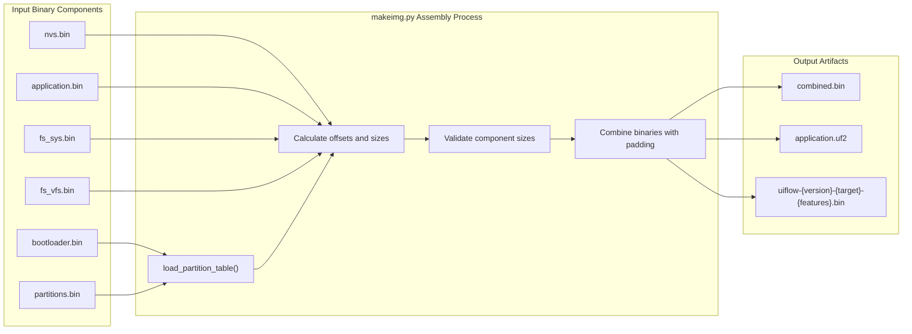
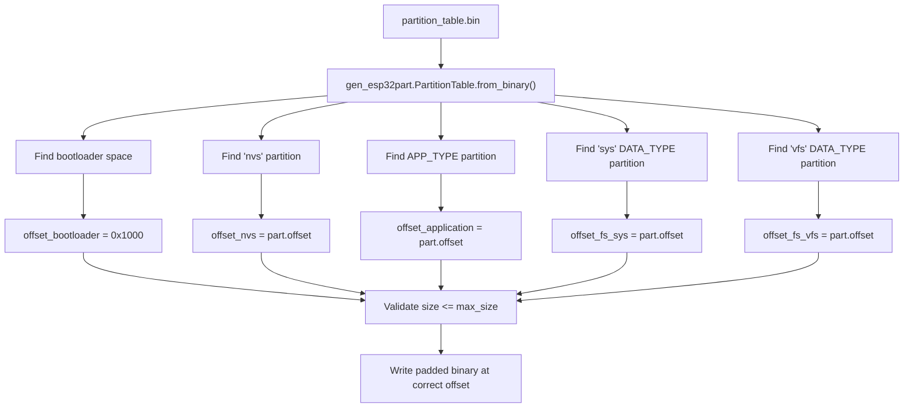

# Board Configurations and Firmware Assembly

Relevant source files

The following files were used as context for generating this wiki page:

- [.github/workflows/build-release.yml](.github/workflows/build-release.yml)
- [.github/workflows/code_formatting.yml](.github/workflows/code_formatting.yml)
- [.github/workflows/nightly-build.yml](.github/workflows/nightly-build.yml)
- [.github/workflows/ports_m5stack.yml](.github/workflows/ports_m5stack.yml)
- [.gitlab-ci.yml](.gitlab-ci.yml)
- [.gitmodules](.gitmodules)
- [README.md](README.md)
- [m5stack/boards/M5STACK_AtomS3R_CAM/board.json](m5stack/boards/M5STACK_AtomS3R_CAM/board.json)
- [m5stack/boards/M5STACK_AtomS3R_CAM/mpconfigboard.cmake](m5stack/boards/M5STACK_AtomS3R_CAM/mpconfigboard.cmake)
- [m5stack/boards/M5STACK_AtomS3R_CAM/mpconfigboard.h](m5stack/boards/M5STACK_AtomS3R_CAM/mpconfigboard.h)
- [m5stack/boards/M5STACK_AtomS3R_CAM/sdkconfig.board](m5stack/boards/M5STACK_AtomS3R_CAM/sdkconfig.board)
- [m5stack/boards/M5STACK_CoreInk/mpconfigboard.cmake](m5stack/boards/M5STACK_CoreInk/mpconfigboard.cmake)
- [m5stack/boards/M5STACK_CoreInk/mpconfigboard.h](m5stack/boards/M5STACK_CoreInk/mpconfigboard.h)
- [m5stack/boards/M5STACK_CoreInk/sdkconfig.board](m5stack/boards/M5STACK_CoreInk/sdkconfig.board)
- [m5stack/boards/M5STACK_PaperS3/mpconfigboard.cmake](m5stack/boards/M5STACK_PaperS3/mpconfigboard.cmake)
- [m5stack/boards/M5STACK_PaperS3/sdkconfig.board](m5stack/boards/M5STACK_PaperS3/sdkconfig.board)
- [m5stack/cmodules/cmodules.cmake](m5stack/cmodules/cmodules.cmake)
- [m5stack/components/M5Unified/CMakeLists.txt](m5stack/components/M5Unified/CMakeLists.txt)
- [m5stack/modules/startup/manifest_coreink.py](m5stack/modules/startup/manifest_coreink.py)
- [m5stack/modules/startup/paper/apps/dev.py](m5stack/modules/startup/paper/apps/dev.py)
- [m5stack/modules/startup/paper/apps/status_bar.py](m5stack/modules/startup/paper/apps/status_bar.py)
- [tools/ci.sh](tools/ci.sh)

This page documents the board-specific configuration system and the final firmware binary assembly process in the M5Stack UIFlow MicroPython ecosystem. It covers how different M5Stack hardware variants are configured during build time, how components are conditionally included based on board capabilities, and how the various binary components are assembled into final flashable firmware images.

For information about the overall build system architecture, see [Build System Architecture](#5.1). For details about the CI/CD pipelines that orchestrate these processes, see [CI/CD Pipeline](#5.2).

## Board Configuration System

The firmware supports a wide range of M5Stack devices through a hierarchical configuration system. Each supported board has its own configuration directory under `m5stack/boards/` with board-specific settings that control hardware features, component inclusion, and build parameters.

### Configuration File Hierarchy

**Sources: ** [m5stack/boards/M5STACK_C3/mpconfigboard.cmake:1-19](https://github.com/m5stack/uiflow-micropython/blob/7af4551a/m5stack/boards/M5STACK_C3/mpconfigboard.cmake#L1-L19), [m5stack/boards/M5STACK_C3_USB/mpconfigboard.cmake:1-20](https://github.com/m5stack/uiflow-micropython/blob/7af4551a/m5stack/boards/M5STACK_C3_USB/mpconfigboard.cmake#L1-L20), [m5stack/boards/M5STACK_PaperS3/mpconfigboard.cmake:1-41](https://github.com/m5stack/uiflow-micropython/blob/7af4551a/m5stack/boards/M5STACK_PaperS3/mpconfigboard.cmake#L1-L41), [m5stack/boards/M5STACK_C3/mpconfigboard.h:1-18](https://github.com/m5stack/uiflow-micropython/blob/7af4551a/m5stack/boards/M5STACK_C3/mpconfigboard.h#L1-L18), [m5stack/boards/M5STACK_C3_USB/mpconfigboard.h:1-18](https://github.com/m5stack/uiflow-micropython/blob/7af4551a/m5stack/boards/M5STACK_C3_USB/mpconfigboard.h#L1-L18)

### Board Configuration Processing

The CMake build system processes board configurations through a multi-stage approach that consolidates various configuration sources into a unified build configuration.

| Configuration Stage | Files Processed | Purpose |
|---------------------|-----------------|---------|
| Board Selection | `mpconfigboard.cmake` | Sets `IDF_TARGET`, `BOARD_ID`, component flags |
| SDK Configuration | `sdkconfig.*` files | ESP-IDF specific settings, hardware features |
| Component Inclusion | `cmodules.cmake` | Conditional C module inclusion based on board type |
| Manifest Processing | `manifest.py` | Python module freezing and inclusion |

The configuration consolidation process is handled in [m5stack/CMakeLists.txt:66-73]() where all `SDKCONFIG_DEFAULTS` files are concatenated into a single configuration file for ESP-IDF consumption.

**Sources: ** [m5stack/CMakeLists.txt:22-99](https://github.com/m5stack/uiflow-micropython/blob/7af4551a/m5stack/CMakeLists.txt#L22-L99), [m5stack/boards/sdkconfig.base:1-144](https://github.com/m5stack/uiflow-micropython/blob/7af4551a/m5stack/boards/sdkconfig.base#L1-L144)

## Component Inclusion Logic

The firmware assembly includes conditional logic for enabling different hardware and software components based on board capabilities and build flags. This ensures that each board variant only includes the components it can actually utilize.

### Component Inclusion Decision Tree

**Sources: ** [m5stack/cmodules/cmodules.cmake:1-49](https://github.com/m5stack/uiflow-micropython/blob/7af4551a/m5stack/cmodules/cmodules.cmake#L1-L49)

### Component Configuration Matrix

| Component | Condition | Implementation File |
|-----------|-----------|-------------------|
| `m5audio2` | `IDF_TARGET` in (esp32, esp32s3, esp32p4) | `m5audio2/m5audio2.cmake` |
| `omv` (OpenMV) | `BOARD_TYPE == "cores3"` AND `M5_CAMERA_MODULE_ENABLE` | `omv/micropython.cmake` |
| `m5camera` | `M5_CAMERA_MODULE_ENABLE` AND not cores3 | `m5camera/m5camera.cmake` |
| `lv_binding` | `MICROPY_PY_LVGL` is set | `lv_binding_micropython/micropython.cmake` |
| `adf_module` | `ADF_MODULE_ENABLE` is set | `adf_module/micropython.cmake` |
| Core modules | Always included | `m5utils`, `m5can`, `m5unified`, `rf433`, `esp_zigbee_host` |

**Sources: ** [m5stack/cmodules/cmodules.cmake:9-48](https://github.com/m5stack/uiflow-micropython/blob/7af4551a/m5stack/cmodules/cmodules.cmake#L9-L48)

## Firmware Assembly Process

The final firmware binary is assembled by the `makeimg.py` script, which combines multiple component binaries into a single flashable image according to the ESP32 partition table layout.

### Binary Component Assembly

**Sources: ** [m5stack/makeimg.py:1-226](https://github.com/m5stack/uiflow-micropython/blob/7af4551a/m5stack/makeimg.py#L1-L226)

### Memory Layout and Partition Processing

The firmware assembly process reads the partition table to determine the correct memory layout for each component. The script validates that each component fits within its allocated partition space.

The assembly process iterates through components in memory order, writing each binary at its designated offset with appropriate padding ([m5stack/makeimg.py:139-159]()).

**Sources: ** [m5stack/makeimg.py:89-128](https://github.com/m5stack/uiflow-micropython/blob/7af4551a/m5stack/makeimg.py#L89-L128), [m5stack/makeimg.py:139-175](https://github.com/m5stack/uiflow-micropython/blob/7af4551a/m5stack/makeimg.py#L139-L175)

### Configuration-Based Feature Detection

The `makeimg.py` script extracts build configuration information from the sdkconfig file to generate appropriate firmware filenames and enable conditional features like UF2 generation for USB-capable chips.

| Configuration Key | Purpose | Implementation |
|-------------------|---------|----------------|
| `CONFIG_IDF_TARGET` | Determine chip type for UF2 support | [m5stack/makeimg.py:81]() |
| `CONFIG_SPIRAM_SUPPORT` | Add SPIRAM indicator to filename | [m5stack/makeimg.py:36-43]() |
| `CONFIG_ESPTOOLPY_FLASHSIZE` | Include flash size in filename | [m5stack/makeimg.py:46-52]() |
| `CONFIG_ESP_CONSOLE_USB_SERIAL_JTAG` | Add USB indicator for ESP32C3 | [m5stack/makeimg.py:193-194]() |

**Sources: ** [m5stack/makeimg.py:18-60](https://github.com/m5stack/uiflow-micropython/blob/7af4551a/m5stack/makeimg.py#L18-L60), [m5stack/makeimg.py:178-225](https://github.com/m5stack/uiflow-micropython/blob/7af4551a/m5stack/makeimg.py#L178-L225)

## Output Artifacts and Naming

The firmware assembly process generates multiple output formats with systematic naming conventions that encode board type, chip features, and version information.

### Firmware Naming Convention

Example: `uiflow-abc1234-esp32s3-spiram-8mb-atoms3-lvgl-v2.0.0-alpha-20240315.bin`

### Output File Generation

The assembly process generates three types of output files:

| File Type | Condition | Purpose |
|-----------|-----------|---------|
| Combined binary | Always | Main flashable firmware image |
| UF2 file | ESP32S2/ESP32S3 only | USB flashing support |
| Release binary | Always | Renamed with full version info |

The UF2 file generation is handled specifically for chips with native USB support ([m5stack/makeimg.py:178-187]()) using the MicroPython `uf2conv` utility.

**Sources: ** [m5stack/makeimg.py:178-225](https://github.com/m5stack/uiflow-micropython/blob/7af4551a/m5stack/makeimg.py#L178-L225), [m5stack/makeimg.py:189-225](https://github.com/m5stack/uiflow-micropython/blob/7af4551a/m5stack/makeimg.py#L189-L225)