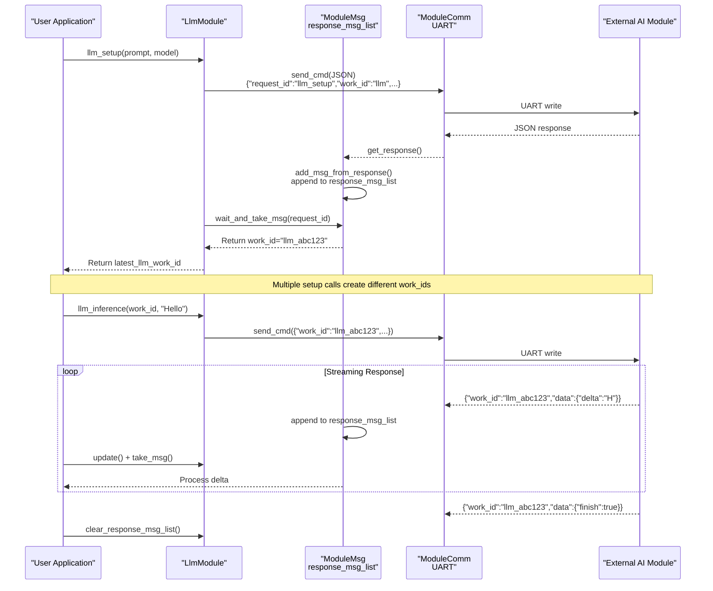
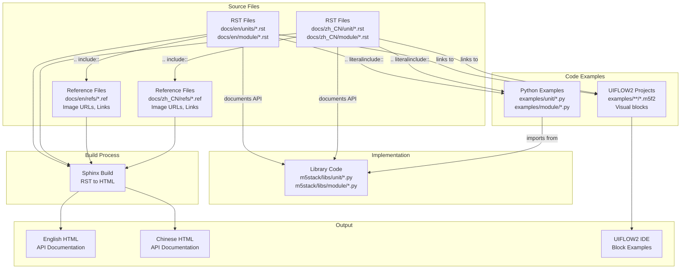
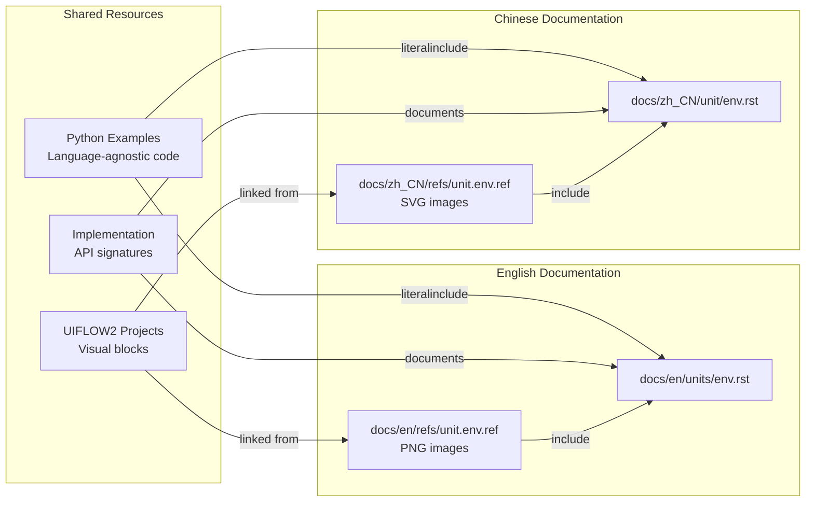
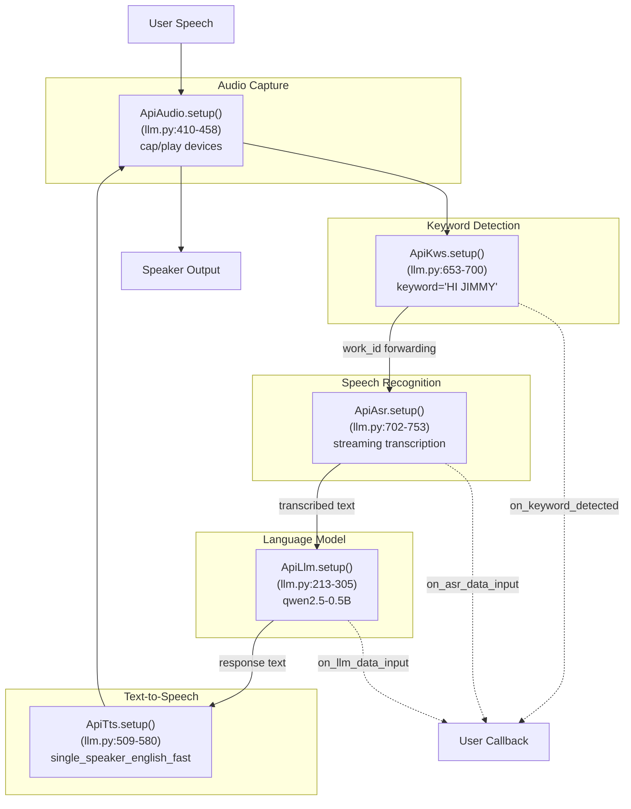
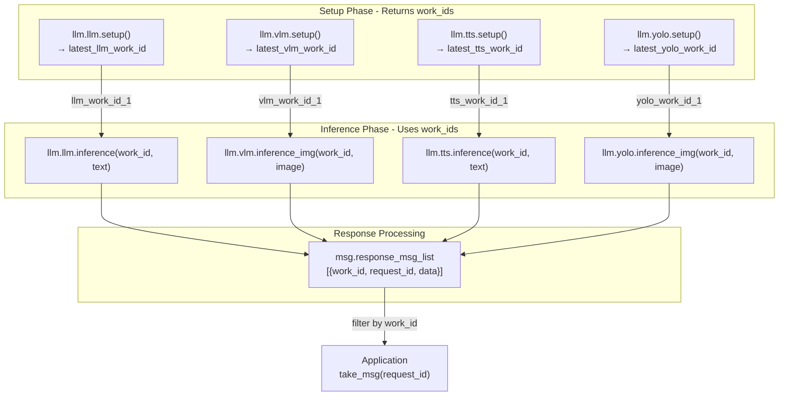

# Advanced Features

Relevant source files

The following files were used as context for generating this wiki page:

- [docs/en/refs/module.llm.ref](docs/en/refs/module.llm.ref)
- [docs/en/refs/unit.angle.ref](docs/en/refs/unit.angle.ref)
- [docs/en/refs/unit.env.ref](docs/en/refs/unit.env.ref)
- [docs/en/refs/unit.rgb.ref](docs/en/refs/unit.rgb.ref)
- [docs/en/units/env.rst](docs/en/units/env.rst)
- [docs/en/units/rgb.rst](docs/en/units/rgb.rst)
- [docs/zh_CN/refs/unit.angle.ref](docs/zh_CN/refs/unit.angle.ref)
- [docs/zh_CN/refs/unit.dlight.ref](docs/zh_CN/refs/unit.dlight.ref)
- [docs/zh_CN/refs/unit.dual_button.ref](docs/zh_CN/refs/unit.dual_button.ref)
- [docs/zh_CN/refs/unit.env.ref](docs/zh_CN/refs/unit.env.ref)
- [docs/zh_CN/refs/unit.ir.ref](docs/zh_CN/refs/unit.ir.ref)
- [docs/zh_CN/refs/unit.light.ref](docs/zh_CN/refs/unit.light.ref)
- [docs/zh_CN/refs/unit.rgb.ref](docs/zh_CN/refs/unit.rgb.ref)
- [docs/zh_CN/unit/angle.rst](docs/zh_CN/unit/angle.rst)
- [docs/zh_CN/unit/env.rst](docs/zh_CN/unit/env.rst)
- [docs/zh_CN/unit/index.rst](docs/zh_CN/unit/index.rst)
- [docs/zh_CN/unit/ir.rst](docs/zh_CN/unit/ir.rst)
- [docs/zh_CN/unit/rgb.rst](docs/zh_CN/unit/rgb.rst)
- [examples/module/llm/kws_asr.m5f2](examples/module/llm/kws_asr.m5f2)
- [examples/module/llm/kws_asr_zh_CN.m5f2](examples/module/llm/kws_asr_zh_CN.m5f2)
- [examples/module/llm/llm_voice_assista_zh_CN.m5f2](examples/module/llm/llm_voice_assista_zh_CN.m5f2)
- [examples/module/llm/llm_voice_assistant.m5f2](examples/module/llm/llm_voice_assistant.m5f2)
- [examples/module/llm/text_assistant.m5f2](examples/module/llm/text_assistant.m5f2)
- [examples/module/llm/tts.m5f2](examples/module/llm/tts.m5f2)
- [examples/module/llm/tts_zh_CN.m5f2](examples/module/llm/tts_zh_CN.m5f2)
- [examples/module/llm/yolo.m5f2](examples/module/llm/yolo.m5f2)
- [examples/unit/env/env_cores3.py](examples/unit/env/env_cores3.py)
- [m5stack/libs/module/llm.py](m5stack/libs/module/llm.py)

This document provides an overview of specialized features that extend the UIFlow MicroPython firmware beyond basic hardware control. It covers the AI/LLM integration system for natural language processing and computer vision tasks, and the multi-language documentation infrastructure that supports both text-based and visual programming workflows.

For detailed information about the LLM module API and usage patterns, see [LLM and AI Module](#6.1). For documentation authoring guidelines and the RST-based system, see [Documentation System](#6.2).

## Overview

The firmware includes two major specialized subsystems:

1. **AI/LLM Integration** - A UART-based module system ([m5stack/libs/module/llm.py]()) that provides access to external AI accelerators running large language models (LLM), vision-language models (VLM), speech recognition (ASR/Whisper), text-to-speech (TTS), keyword spotting (KWS), voice activity detection (VAD), and object detection (YOLO). The system uses JSON-based message passing with work ID tracking to manage multiple concurrent AI pipelines.

2. **Documentation System** - A multi-language (English/Chinese) documentation infrastructure using reStructuredText (RST) format with reusable reference files ([docs/en/refs/*.ref](), [docs/zh_CN/refs/*.ref]()), Python code examples with `literalinclude` directives, and UIFLOW2 visual programming projects ([examples/**/*.m5f2]()). This system generates API documentation synchronized with working code.

## LLM Module Architecture

The LLM module provides a comprehensive API for AI inference tasks on external hardware via UART communication. The architecture separates concerns into communication layer, message queue management, and specialized API classes for different AI functions.

**LLM Module Class Structure**

```mermaid
graph TB
    subgraph "Core Communication Layer"
        LlmModule["LlmModule<br/>(llm.py:904-1307+)"]
        ModuleComm["ModuleComm<br/>(llm.py:10-37)"]
        ModuleMsg["ModuleMsg<br/>(llm.py:40-92)"]
    end
    
    subgraph "System Management API"
        ApiSys["ApiSys<br/>(llm.py:94-211)<br/>ping/reset/version/lsmode"]
    end
    
    subgraph "Language Model APIs"
        ApiLlm["ApiLlm<br/>(llm.py:213-305)<br/>setup/inference"]
        ApiVlm["ApiVlm<br/>(llm.py:307-407)<br/>setup/inference/inference_img"]
    end
    
    subgraph "Audio Processing APIs"
        ApiAudio["ApiAudio<br/>(llm.py:410-458)<br/>setup"]
        ApiTts["ApiTts<br/>(llm.py:509-580)<br/>setup/inference"]
        ApiMelotts["ApiMelotts<br/>(llm.py:582-651)<br/>setup/inference"]
    end
    
    subgraph "Speech Recognition APIs"
        ApiKws["ApiKws<br/>(llm.py:653-700)<br/>setup keyword spotting"]
        ApiAsr["ApiAsr<br/>(llm.py:702-753)<br/>setup streaming ASR"]
        ApiWhisper["ApiWhisper<br/>(llm.py:800-845)<br/>setup batch ASR"]
        ApiVad["ApiVad<br/>(llm.py:755-798)<br/>setup voice detection"]
    end
    
    subgraph "Computer Vision API"
        ApiYolo["ApiYolo<br/>(llm.py:847-902)<br/>setup/inference_img"]
        ApiCamera["ApiCamera<br/>(llm.py:460-507)<br/>setup"]
    end
    
    LlmModule -->|"__init__<br/>uart,comm,msg"| ModuleComm
    LlmModule -->|"creates"| ModuleMsg
    ModuleComm -->|"used by"| ModuleMsg
    
    LlmModule -->|"self.sys"| ApiSys
    LlmModule -->|"self.llm"| ApiLlm
    LlmModule -->|"self.vlm"| ApiVlm
    LlmModule -->|"self.audio"| ApiAudio
    LlmModule -->|"self.tts"| ApiTts
    LlmModule -->|"self.melotts"| ApiMelotts
    LlmModule -->|"self.kws"| ApiKws
    LlmModule -->|"self.asr"| ApiAsr
    LlmModule -->|"self.whisper"| ApiWhisper
    LlmModule -->|"self.vad"| ApiVad
    LlmModule -->|"self.yolo"| ApiYolo
    LlmModule -->|"self.camera"| ApiCamera
    
    ApiSys -.->|"passes"| ModuleMsg
    ApiLlm -.->|"passes"| ModuleMsg
    ApiVlm -.->|"passes"| ModuleMsg
    ApiAudio -.->|"passes"| ModuleMsg
    ApiTts -.->|"passes"| ModuleMsg
    ApiMelotts -.->|"passes"| ModuleMsg
    ApiKws -.->|"passes"| ModuleMsg
    ApiAsr -.->|"passes"| ModuleMsg
    ApiWhisper -.->|"passes"| ModuleMsg
    ApiVad -.->|"passes"| ModuleMsg
    ApiYolo -.->|"passes"| ModuleMsg
    ApiCamera -.->|"passes"| ModuleMsg
```

Sources: [m5stack/libs/module/llm.py:10-1307+]()

**Message Queue and Work ID Tracking**

The LLM module uses a JSON-based request/response protocol with unique identifiers for tracking concurrent operations:

Sources: [m5stack/libs/module/llm.py:40-92](https://github.com/m5stack/uiflow-micropython/blob/7af4551a/m5stack/libs/module/llm.py#L40-L92), [m5stack/libs/module/llm.py:213-305](https://github.com/m5stack/uiflow-micropython/blob/7af4551a/m5stack/libs/module/llm.py#L213-L305)

## Documentation System Architecture

The documentation system supports multiple user personas (text programmers, visual programmers, international users) through a layered architecture combining RST files, reference definitions, executable examples, and visual programming projects.

**Documentation Generation Flow**

Sources: [docs/en/units/env.rst:1-93](https://github.com/m5stack/uiflow-micropython/blob/7af4551a/docs/en/units/env.rst#L1-L93), [docs/zh_CN/unit/env.rst:1-92](https://github.com/m5stack/uiflow-micropython/blob/7af4551a/docs/zh_CN/unit/env.rst#L1-L92), [docs/en/refs/unit.env.ref:1-28](https://github.com/m5stack/uiflow-micropython/blob/7af4551a/docs/en/refs/unit.env.ref#L1-L28), [docs/zh_CN/refs/unit.env.ref:1-28](https://github.com/m5stack/uiflow-micropython/blob/7af4551a/docs/zh_CN/refs/unit.env.ref#L1-L28), [examples/unit/env/env_cores3.py:1-50](https://github.com/m5stack/uiflow-micropython/blob/7af4551a/examples/unit/env/env_cores3.py#L1-L50)

**Reference File Pattern**

The `.ref` files define reusable image URLs, product links, and UIFLOW2 example links that can be included in multiple RST documents:

| Component | Purpose | Example |
|-----------|---------|---------|
| **Product Images** | Hardware photos with links to documentation | `\|ENV\| image:: https://static-cdn.m5stack.com/...` |
| **Block Diagrams** | UIFLOW2 visual programming blocks | `\|init.png\| image:: https://static-cdn.m5stack.com/mpy_docs/...` |
| **Method Diagrams** | Visual representation of API methods | `\|read_temperature.png\| image:: ...` |
| **Example Links** | Clickable links to load UIFLOW2 projects | `\|env_cores3_example.m5f2\| raw:: html` |

Sources: [docs/en/refs/unit.env.ref:1-28](https://github.com/m5stack/uiflow-micropython/blob/7af4551a/docs/en/refs/unit.env.ref#L1-L28), [docs/zh_CN/refs/unit.env.ref:1-28](https://github.com/m5stack/uiflow-micropython/blob/7af4551a/docs/zh_CN/refs/unit.env.ref#L1-L28)

**Multi-Language Synchronization Strategy**

Sources: [docs/en/units/env.rst:13-30](https://github.com/m5stack/uiflow-micropython/blob/7af4551a/docs/en/units/env.rst#L13-L30), [docs/zh_CN/unit/env.rst:13-30](https://github.com/m5stack/uiflow-micropython/blob/7af4551a/docs/zh_CN/unit/env.rst#L13-L30)

## Integration Patterns

### Voice Assistant Preset Pipeline

The LLM module provides a preset voice assistant workflow that chains multiple AI components:

Sources: [m5stack/libs/module/llm.py:1195-1307+](), [examples/module/llm/llm_voice_assistant.m5f2:1](https://github.com/m5stack/uiflow-micropython/blob/7af4551a/examples/module/llm/llm_voice_assistant.m5f2#L1)

### Documentation Cross-References

The documentation system maintains bidirectional links between different artifact types:

| Source Type | Target Type | Mechanism | Example |
|-------------|-------------|-----------|---------|
| **RST → .ref** | Include images/links | `.. include:: ../refs/unit.env.ref` | [docs/en/units/env.rst:4]() |
| **RST → Python** | Embed code | `.. literalinclude:: ../../../examples/unit/env/env_cores3.py` | [docs/en/units/env.rst:13-30]() |
| **RST → .m5f2** | Link visual examples | `\|env_cores3_example.m5f2\|` | [docs/en/refs/unit.env.ref:24-27]() |
| **Python → Implementation** | Import statements | `from unit import ENVUnit` | [examples/unit/env/env_cores3.py:9]() |
| **.m5f2 → Implementation** | Generated code | `blockly` JSON field | [examples/module/llm/llm_voice_assistant.m5f2:1]() |

Sources: [docs/en/units/env.rst:1-93](https://github.com/m5stack/uiflow-micropython/blob/7af4551a/docs/en/units/env.rst#L1-L93), [docs/en/refs/unit.env.ref:1-28](https://github.com/m5stack/uiflow-micropython/blob/7af4551a/docs/en/refs/unit.env.ref#L1-L28), [examples/unit/env/env_cores3.py:1-50](https://github.com/m5stack/uiflow-micropython/blob/7af4551a/examples/unit/env/env_cores3.py#L1-L50)

## Work ID Management for Multi-Pipeline Scenarios

The LLM module tracks work IDs to support concurrent AI pipelines. Each `setup()` call returns a unique work ID that subsequent `inference()` calls must reference:

Sources: [m5stack/libs/module/llm.py:904-1307+](), [m5stack/libs/module/llm.py:40-92](https://github.com/m5stack/uiflow-micropython/blob/7af4551a/m5stack/libs/module/llm.py#L40-L92)

## Use Cases and Examples

### LLM Integration Examples

The firmware includes multiple example patterns for AI integration:

| Example | Primary APIs Used | Description |
|---------|-------------------|-------------|
| **llm_voice_assistant.m5f2** | KWS → ASR → LLM → TTS | Complete voice assistant with callbacks | 
| **text_assistant.m5f2** | LLM only | Text-based Q&A without audio |
| **kws_asr.m5f2** | KWS → ASR | Speech recognition triggered by keyword |
| **tts.m5f2** | TTS only | Text-to-speech synthesis |
| **yolo.m5f2** | Camera → YOLO | Object detection pipeline |

Sources: [examples/module/llm/llm_voice_assistant.m5f2:1](https://github.com/m5stack/uiflow-micropython/blob/7af4551a/examples/module/llm/llm_voice_assistant.m5f2#L1), [examples/module/llm/text_assistant.m5f2:1](https://github.com/m5stack/uiflow-micropython/blob/7af4551a/examples/module/llm/text_assistant.m5f2#L1), [examples/module/llm/kws_asr.m5f2:1](https://github.com/m5stack/uiflow-micropython/blob/7af4551a/examples/module/llm/kws_asr.m5f2#L1), [examples/module/llm/tts.m5f2:1](https://github.com/m5stack/uiflow-micropython/blob/7af4551a/examples/module/llm/tts.m5f2#L1), [examples/module/llm/yolo.m5f2:1](https://github.com/m5stack/uiflow-micropython/blob/7af4551a/examples/module/llm/yolo.m5f2#L1)

### Documentation Examples

Documentation is organized by hardware package with consistent patterns:

| Package | Index File | Example Unit | Chinese Support |
|---------|-----------|--------------|-----------------|
| **Unit** | [docs/en/units/index.rst]() | env.rst, angle.rst, rgb.rst | [docs/zh_CN/unit/index.rst:1-24]() |
| **Module** | [docs/en/module/index.rst]() | llm.rst | [docs/zh_CN/module/index.rst]() |
| **HAT** | [docs/en/hats/index.rst]() | servo.rst, pir.rst | [docs/zh_CN/hat/index.rst]() |
| **M5UI** | [docs/en/m5ui/index.rst]() | bar.rst, label.rst | [docs/zh_CN/m5ui/index.rst]() |

Sources: [docs/zh_CN/unit/index.rst:1-24](https://github.com/m5stack/uiflow-micropython/blob/7af4551a/docs/zh_CN/unit/index.rst#L1-L24), [docs/en/units/env.rst:1-93](https://github.com/m5stack/uiflow-micropython/blob/7af4551a/docs/en/units/env.rst#L1-L93), [docs/zh_CN/unit/env.rst:1-92](https://github.com/m5stack/uiflow-micropython/blob/7af4551a/docs/zh_CN/unit/env.rst#L1-L92)