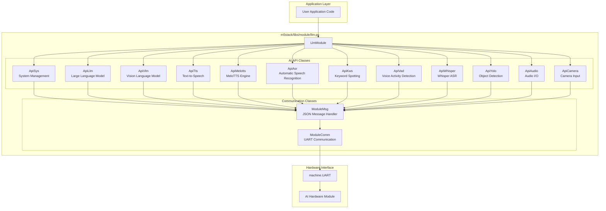
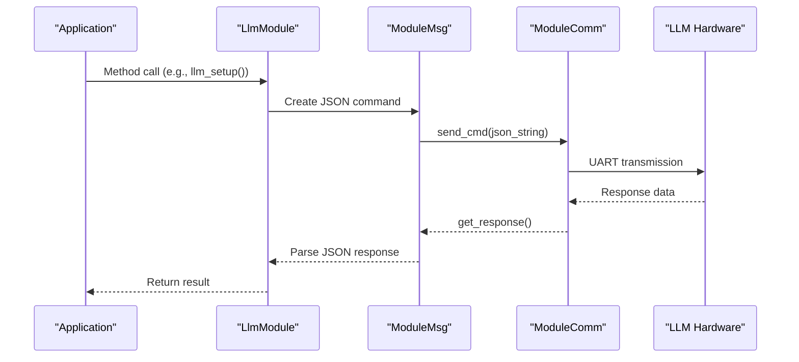
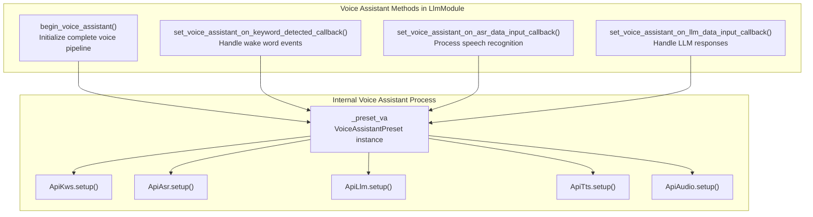
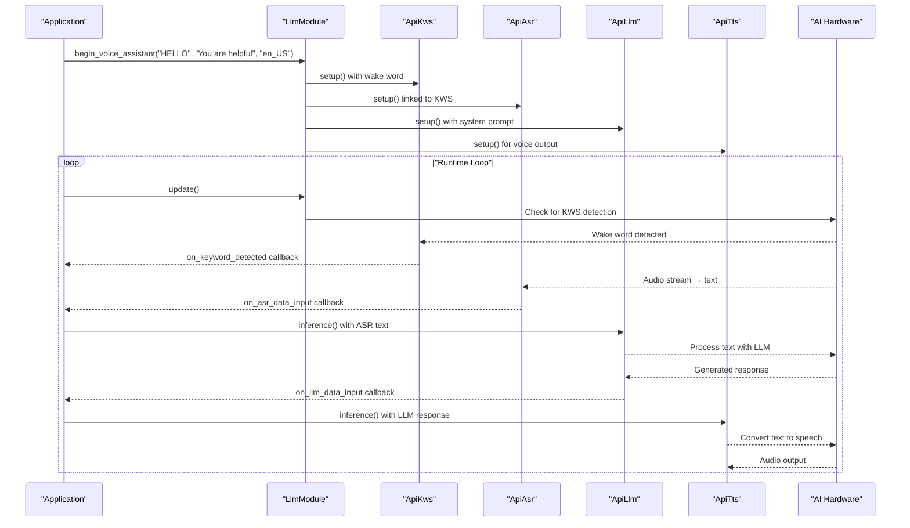

# LLM and AI Module

<details>
<summary>Relevant source files</summary>

The following files were used as context for generating this wiki page:

- [docs/en/refs/module.llm.ref](docs/en/refs/module.llm.ref)
- [examples/module/llm/kws_asr.m5f2](examples/module/llm/kws_asr.m5f2)
- [examples/module/llm/kws_asr_zh_CN.m5f2](examples/module/llm/kws_asr_zh_CN.m5f2)
- [examples/module/llm/llm_voice_assista_zh_CN.m5f2](examples/module/llm/llm_voice_assista_zh_CN.m5f2)
- [examples/module/llm/llm_voice_assistant.m5f2](examples/module/llm/llm_voice_assistant.m5f2)
- [examples/module/llm/text_assistant.m5f2](examples/module/llm/text_assistant.m5f2)
- [examples/module/llm/tts.m5f2](examples/module/llm/tts.m5f2)
- [examples/module/llm/tts_zh_CN.m5f2](examples/module/llm/tts_zh_CN.m5f2)
- [examples/module/llm/yolo.m5f2](examples/module/llm/yolo.m5f2)
- [m5stack/libs/module/llm.py](m5stack/libs/module/llm.py)

</details>


The LLM and AI Module provides a comprehensive interface for integrating advanced artificial intelligence capabilities into M5Stack devices. This module enables access to large language models (LLMs), vision language models (VLMs), speech recognition, text-to-speech, keyword spotting, computer vision, and other AI/ML functionalities through a unified API. It communicates with external AI hardware accelerators via UART to offload computationally intensive AI tasks from the M5Stack device.

## Architecture Overview

### AI Module Class Hierarchy

The LLM and AI Module uses a layered architecture built around the `LlmModule` class and specialized API classes for different AI capabilities.



Sources: [m5stack/libs/module/llm.py:904-932](https://github.com/m5stack/uiflow-micropython/blob/7af4551a/m5stack/libs/module/llm.py#L904-L932), [m5stack/libs/module/llm.py:10-40](https://github.com/m5stack/uiflow-micropython/blob/7af4551a/m5stack/libs/module/llm.py#L10-L40), [m5stack/libs/module/llm.py:40-93](https://github.com/m5stack/uiflow-micropython/blob/7af4551a/m5stack/libs/module/llm.py#L40-L93)

## Communication Protocol

All communication between the M5Stack device and the LLM hardware module uses JSON messages over UART. The protocol follows a request-response pattern:



Sources: [m5stack/libs/module/llm.py:12-96](https://github.com/m5stack/uiflow-micropython/blob/7af4551a/m5stack/libs/module/llm.py#L12-L96)

## Core Components

### LlmModule Class

The `LlmModule` class is the primary interface for applications. It initializes the UART connection and creates instances of all API classes.

```python
llm = LlmModule(uart_id=1, tx=17, rx=16)
```

Key methods:
- `update()`: Process incoming messages
- `check_connection()`: Verify module connectivity
- `sys_reset()`: Reset the module
- Setup methods for various functionalities

Sources: [m5stack/libs/module/llm.py:782-826](https://github.com/m5stack/uiflow-micropython/blob/7af4551a/m5stack/libs/module/llm.py#L782-L826), [m5stack/libs/module/llm.py:832-883](https://github.com/m5stack/uiflow-micropython/blob/7af4551a/m5stack/libs/module/llm.py#L832-L883)

### Communication Classes

#### ModuleComm

Handles low-level UART communication:

- `send_cmd(cmd)`: Send a command string
- `get_response(timeout)`: Retrieve response with timeout

Sources: [m5stack/libs/module/llm.py:12-40](https://github.com/m5stack/uiflow-micropython/blob/7af4551a/m5stack/libs/module/llm.py#L12-L40)

#### ModuleMsg

Manages JSON message processing:

- `update()`: Check for new messages
- `add_msg_from_response(response)`: Parse JSON responses
- `wait_and_take_msg(request_id, on_msg, timeout)`: Wait for a specific response
- `send_cmd_and_wait_to_take_msg(cmd, request_id, on_msg, timeout)`: Send command and wait for response

Sources: [m5stack/libs/module/llm.py:43-96](https://github.com/m5stack/uiflow-micropython/blob/7af4551a/m5stack/libs/module/llm.py#L43-L96)

## Functional APIs

The LLM module provides specialized APIs for different AI capabilities:

### System API (ApiSys)

Manages core module functionality:

- `ping()`: Connection check
- `version()`: Get firmware version
- `reset()`: Reset the module
- `reboot()`: Reboot the module

Sources: [m5stack/libs/module/llm.py:98-214](https://github.com/m5stack/uiflow-micropython/blob/7af4551a/m5stack/libs/module/llm.py#L98-L214)

### LLM API (ApiLlm)

The `ApiLlm` class provides large language model interactions with streaming response support:

- `setup()`: Configure the LLM with specified model and parameters
- `inference()`: Send input to the model for processing
- `inference_and_wait_result()`: Send input and wait for complete streaming response

### Vision Language Model API (ApiVlm)

The `ApiVlm` class enables multimodal AI interactions combining text and image inputs:

- `setup()`: Configure VLM with model like "internvl2.5-1B-364-ax630c"
- `inference()`: Send text input to the model
- `inference_img()`: Send base64-encoded image data for analysis
- `inference_and_wait_result()`: Process multimodal inputs with streaming output

Sources: [m5stack/libs/module/llm.py:213-305](https://github.com/m5stack/uiflow-micropython/blob/7af4551a/m5stack/libs/module/llm.py#L213-L305), [m5stack/libs/module/llm.py:307-407](https://github.com/m5stack/uiflow-micropython/blob/7af4551a/m5stack/libs/module/llm.py#L307-L407)

### Text-to-Speech APIs (ApiTts and ApiMelotts)

Convert text to audio:

- `setup()`: Configure TTS with model and parameters
- `inference()`: Convert text to speech

Sources: [m5stack/libs/module/llm.py:406-545](https://github.com/m5stack/uiflow-micropython/blob/7af4551a/m5stack/libs/module/llm.py#L406-L545)

### Speech Recognition APIs (ApiKws, ApiAsr, ApiVad, ApiWhisper)

Provide various speech processing capabilities:

- Keyword Spotting (wake word detection)
- Automatic Speech Recognition
- Voice Activity Detection
- Whisper-based speech recognition

Sources: [m5stack/libs/module/llm.py:548-735](https://github.com/m5stack/uiflow-micropython/blob/7af4551a/m5stack/libs/module/llm.py#L548-L735)

### Vision APIs (ApiCamera, ApiYolo)

Enable computer vision capabilities:

- Camera input configuration
- Object detection using YOLO

Sources: [m5stack/libs/module/llm.py:358-404](https://github.com/m5stack/uiflow-micropython/blob/7af4551a/m5stack/libs/module/llm.py#L358-L404), [m5stack/libs/module/llm.py:738-779](https://github.com/m5stack/uiflow-micropython/blob/7af4551a/m5stack/libs/module/llm.py#L738-L779)

## Voice Assistant System

### Voice Assistant API Methods

The `LlmModule` class provides high-level voice assistant functionality through these key methods:



### Voice Assistant Runtime Pipeline



Sources: [m5stack/libs/module/llm.py:1143-1251](https://github.com/m5stack/uiflow-micropython/blob/7af4551a/m5stack/libs/module/llm.py#L1143-L1251), [examples/module/llm/llm_voice_assistant.m5f2]()

## Common Usage Examples

### Basic Initialization

```python
from m5stack.libs.module.llm import LlmModule

# Initialize module
llm = LlmModule(uart_id=1, tx=17, rx=16)

# Check connection
if llm.check_connection():
    print("Module connected")
    
# Reset module
llm.sys_reset(wait_reset_finish=True)
```

### LLM Text Generation

```python
# Setup LLM
llm.llm_setup(
    prompt="You are a helpful assistant.",
    model="qwen2.5-0.5B-prefill-20e",
    enoutput=True
)

# Get work ID and send prompt
work_id = llm.get_latest_llm_work_id()
llm.llm_inference(work_id, "What is 2+2?")

# In main loop:
llm.update()
```

### Text-to-Speech Example

```python
# Setup Audio and TTS
llm.audio_setup(cap_volume=0.5, play_volume=0.15)
llm.tts_setup(
    model="single_speaker_english_fast",
    enoutput=False
)

# Convert text to speech
tts_work_id = llm.get_latest_tts_work_id()
llm.tts_inference(
    tts_work_id,
    "Hello, this is a text-to-speech example.",
    timeout=10000
)
```

### Vision Language Model Example

```python
# Setup camera and VLM for image understanding
llm.camera_setup(
    frame_width=320,
    frame_height=320,
    enoutput=False
)

llm.vlm_setup(
    prompt="Describe what you see in this image.",
    model="internvl2.5-1B-364-ax630c",
    input=["vlm.utf-8"],  # Text input format
    enoutput=True,
    max_token_len=256
)

# Send image for analysis
vlm_work_id = llm.get_latest_vlm_work_id()
llm.vlm_inference_img(vlm_work_id, image_bytes)

# Send text query about the image
llm.vlm_inference(vlm_work_id, "What objects are in this image?")
```

### Speech Recognition with Keyword Spotting

```python
# Setup Audio and ASR with KWS triggering
llm.audio_setup(cap_volume=0.5, play_volume=0.15)

# Setup keyword spotting for wake word detection
llm.kws_setup(
    kws="HI JIMMY",
    model="sherpa-onnx-kws-zipformer-gigaspeech-3.3M-2024-01-01",
    enoutput=True,
    enaudio=True
)

# Setup ASR triggered by KWS
llm.asr_setup(
    model="sherpa-ncnn-streaming-zipformer-20M-2023-02-17",
    enoutput=True,
    enkws=llm.get_latest_kws_work_id(),  # Link ASR to KWS output
    rule1=2.4,  # Timeout rules for ASR
    rule2=1.2,
    rule3=30.0
)

# Process streaming ASR results
def handle_asr_response(msg_list):
    for msg in msg_list:
        if msg["work_id"] == llm.get_latest_asr_work_id():
            asr_text = msg["data"]["delta"]
            print(f"Recognized: {asr_text}")
```

Sources: [m5stack/libs/module/llm.py:1110-1134](https://github.com/m5stack/uiflow-micropython/blob/7af4551a/m5stack/libs/module/llm.py#L1110-L1134), [examples/module/llm/kws_asr.m5f2](), [examples/module/llm/yolo.m5f2]()

## AI Model Support

The LLM and AI Module supports a comprehensive range of models for different AI tasks:

| AI Functionality | Model Class | Available Models | Purpose |
|------------------|-------------|------------------|---------|
| **Language Models** | `ApiLlm` | qwen2.5-0.5B-prefill-20e, qwen2.5-0.5b | Text generation, conversation |
| **Vision Language** | `ApiVlm` | internvl2.5-1B-364-ax630c | Multimodal text+image understanding |
| **Text-to-Speech** | `ApiTts` | single_speaker_english_fast, single_speaker_fast | English voice synthesis |
| **Chinese TTS** | `ApiMelotts` | melotts-zh-cn | Chinese voice synthesis |
| **Keyword Spotting** | `ApiKws` | sherpa-onnx-kws-zipformer-gigaspeech-3.3M-2024-01-01<br/>sherpa-onnx-kws-zipformer-wenetspeech-3.3M-2024-01-01 | Wake word detection (EN/CN) |
| **Speech Recognition** | `ApiAsr` | sherpa-ncnn-streaming-zipformer-20M-2023-02-17<br/>sherpa-ncnn-streaming-zipformer-zh-14M-2023-02-23 | Real-time ASR (EN/CN) |
| **Voice Activity** | `ApiVad` | silero-vad | Speech/silence detection |
| **Whisper ASR** | `ApiWhisper` | whisper-tiny | OpenAI Whisper speech recognition |
| **Object Detection** | `ApiYolo` | yolo11n | Computer vision object detection |

### Model Configuration Examples

```python
# Large Language Model setup
llm.llm_setup(
    model="qwen2.5-0.5B-prefill-20e",
    prompt="You are a helpful assistant.",
    max_token_len=127
)

# Vision Language Model setup  
llm.vlm_setup(
    model="internvl2.5-1B-364-ax630c",
    prompt="Describe what you see in the image.",
    max_token_len=256
)

# YOLO object detection setup
llm.yolo_setup(
    model="yolo11n",
    input=llm.get_latest_camera_work_id()
)
```

Sources: [m5stack/libs/module/llm.py:1036-1104](https://github.com/m5stack/uiflow-micropython/blob/7af4551a/m5stack/libs/module/llm.py#L1036-L1104), [m5stack/libs/module/llm.py:1081-1134](https://github.com/m5stack/uiflow-micropython/blob/7af4551a/m5stack/libs/module/llm.py#L1081-L1134), [m5stack/libs/module/llm.py:1146-1162](https://github.com/m5stack/uiflow-micropython/blob/7af4551a/m5stack/libs/module/llm.py#L1146-L1162)

## Language Support

The module supports both English and Chinese languages for voice assistant applications:

```python
# English voice assistant
llm.begin_voice_assistant(
    wake_up_keyword="HELLO",
    prompt="You are a helpful assistant.",
    language="en_US"
)

# Chinese voice assistant
llm.begin_voice_assistant(
    wake_up_keyword="你好吉米",
    prompt="You are a helpful assistant.",
    language="zh_CN"
)
```

Models are automatically selected based on the specified language.

Sources: [examples/module/llm/llm_voice_assistant.m5f2](), [examples/module/llm/llm_voice_assista_zh_CN.m5f2]()

## Best Practices

1. **Always call `update()` in your main loop**
   The LLM module processes incoming messages in the `update()` method, which should be called frequently.

2. **Use error checking**
   Check return values and error codes to ensure operations succeeded.

3. **Manage memory**
   Clear response message lists regularly to prevent memory issues:
   ```python
   llm.clear_response_msg_list()
   ```

4. **Use appropriate timeouts**
   Adjust timeouts based on your specific use case and network conditions.

5. **Version compatibility**
   Check module version and use compatible models:
   ```python
   version = llm.get_version()
   ```

Sources: [m5stack/libs/module/llm.py:832-868](https://github.com/m5stack/uiflow-micropython/blob/7af4551a/m5stack/libs/module/llm.py#L832-L868)

## Conclusion

The LLM Module provides a powerful yet easy-to-use interface for integrating advanced AI capabilities into M5Stack projects. By offloading complex AI processing to dedicated hardware, it enables sophisticated applications even on resource-constrained devices.